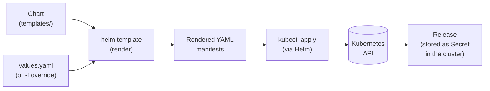

# Helm — Practical Developer Guide

> Not just commands. Real-world daily usage scenarios.

---

## Table of Contents

1. [What is Helm and Why Use It](#1-what-is-helm-and-why-use-it)
2. [Installation and First Run](#2-installation-and-first-run)
3. [Glossary](#3-glossary)
4. [Working with Repositories](#4-working-with-repositories)
5. [Installing and Upgrading Releases](#5-installing-and-upgrading-releases)
6. [Values — Configuring Charts](#6-values--configuring-charts)
7. [Creating Your Own Chart](#7-creating-your-own-chart)
8. [Templates — How It Works](#8-templates--how-it-works)
9. [Debugging](#9-debugging)
10. [Helm in CI/CD](#10-helm-in-cicd)
11. [Useful Aliases and Scripts](#11-useful-aliases-and-scripts)

---

## 1. What is Helm and Why Use It

```
Without Helm:                    With Helm:
  deployment.yaml                  myapp/
  service.yaml          →            Chart.yaml
  ingress.yaml                       values.yaml
  configmap.yaml                     values-prod.yaml
  secret.yaml                        templates/
  hpa.yaml                             deployment.yaml
  pvc.yaml                             service.yaml
  ...                                  ...

kubectl apply -f ./              helm install myapp ./myapp -f values-prod.yaml
```

**Helm solves three problems:**

1. **Packaging** — all application YAML files in one package (chart).
2. **Configuration** — same templates, different values for dev/staging/prod.
3. **Versioning** — every deploy is a numbered release, rollback is built in.

### Diagram: chart → render → release



> `helm rollback` re-applies the rendered YAML from a previous revision,
> stored as a Secret named `sh.helm.release.v1.<name>.v<N>`.

---

## 2. Installation and First Run

```bash
# macOS
brew install helm

# Linux (script)
curl https://raw.githubusercontent.com/helm/helm/main/scripts/get-helm-3 | bash

# Verify version
helm version
```

### Enable shell completion (zsh / bash)

```bash
# zsh
echo 'source <(helm completion zsh)' >> ~/.zshrc

# bash
echo 'source <(helm completion bash)' >> ~/.bashrc
```

---

## 3. Glossary

| Term | What it is |
|---|---|
| **Chart** | A Helm package — a directory with YAML templates + `Chart.yaml` + `values.yaml`. Like an npm package. |
| **Release** | A specific installed instance of a chart in the cluster. One chart → many releases (myapp-dev, myapp-prod). |
| **Revision** | The update number of a release. Every `helm upgrade` increments the revision by 1. Enables rollback. |
| **Repository** | A chart storage server. Like an npm registry or apt repo. Contains an index and chart tar archives. |
| **Values** | A set of variables that parameterize a chart. Defined in `values.yaml` or via `--set`. |
| **Template** | A YAML file with `{{ .Values.xxx }}` placeholders. Helm substitutes values and generates the final YAML. |
| **Subchart** | A dependency chart nested inside another chart (in the `charts/` directory). |
| **Hooks** | Special Jobs or Pods that run before/after install/upgrade/delete. |
| **OCI registry** | Storing charts in a Docker registry (instead of a classic Helm repo). Helm 3.8+. |
| **`helm upgrade --install`** | Idempotent command: installs if absent, upgrades if present. The CI/CD standard. |
| **Release namespace** | The namespace where the release lives. Passed via `-n`. |

---

## 4. Working with Repositories

```bash
# Add a repository
helm repo add bitnami https://charts.bitnami.com/bitnami
helm repo add stable  https://charts.helm.sh/stable

# Update index (like apt-get update)
helm repo update

# List added repositories
helm repo list

# Remove a repository
helm repo remove bitnami
```

### Searching for charts

```bash
# Search in added repositories
helm search repo postgres
helm search repo redis --versions   # show all versions

# Search on Artifact Hub (public catalog of all charts)
helm search hub wordpress
```

### Inspect a chart before installing

```bash
# View values (all settings with comments)
helm show values bitnami/postgresql

# View chart README
helm show readme bitnami/postgresql

# View Chart.yaml (metadata, version, dependencies)
helm show chart bitnami/postgresql

# Download chart locally to explore
helm pull bitnami/postgresql --untar
```

---

## 5. Installing and Upgrading Releases

### Basic commands

```bash
# Install a chart
# helm install <release-name> <chart> [flags]
kubectl create namespace database
helm install my-postgres bitnami/postgresql -n database

# Install or upgrade (idempotent) — the CI/CD standard
helm upgrade --install my-postgres bitnami/postgresql -n database --create-namespace

# List all releases
helm list -A          # all namespaces
helm list -n database # specific namespace

# Release status
helm status my-postgres -n database
```

### Upgrade a release

```bash
# Upgrade with new values or a new chart version
helm upgrade my-postgres bitnami/postgresql \
  -n database \
  -f values.yaml \
  --version 13.2.0      # specific chart version (omitting = latest)
```

### Rollback

```bash
# View release history
helm history my-postgres -n database
# REVISION  STATUS      CHART                  DESCRIPTION
# 1         superseded  postgresql-13.1.0      Install complete
# 2         deployed    postgresql-13.2.0      Upgrade complete

# Roll back to a specific revision
# Check the number in helm history first
helm rollback my-postgres 1 -n database

# Roll back to a different revision
helm rollback my-postgres 3 -n database
```

### Delete a release

```bash
# Delete (all cluster resources are removed)
helm uninstall my-postgres -n database

# Delete but keep history
helm uninstall my-postgres -n database --keep-history
```

### Useful flags for install / upgrade

| Flag | What it does |
|---|---|
| `--install` | Install if it doesn't exist (used with `upgrade`) |
| `--atomic` | If upgrade fails — automatically roll back |
| `--wait` | Wait until all pods are Ready |
| `--timeout 5m` | Timeout for `--wait` |
| `--dry-run` | Don't apply, just show what would happen |
| `--debug` | Verbose output + rendered templates |
| `--create-namespace` | Create namespace if it doesn't exist |
| `--version 13.2.0` | Specific chart version |

---

## 6. Values — Configuring Charts

### Three ways to pass values (lowest to highest priority)

```
1. values.yaml in the chart       (lowest priority — defaults)
         ↓ overridden by
2. -f my-values.yaml              (your values file)
         ↓ overridden by
3. --set key=value                (highest priority — inline)
```

```bash
# -f: pass a values file
helm upgrade --install myapp ./myapp -f values-prod.yaml

# Multiple files — merged left to right
helm upgrade --install myapp ./myapp \
  -f values-base.yaml \
  -f values-prod.yaml

# --set: single value
helm upgrade --install myapp ./myapp \
  --set image.tag=v2.0.0

# --set: nested keys
helm upgrade --install myapp ./myapp \
  --set ingress.enabled=true \
  --set ingress.hosts[0].host=myapp.example.com

# --set-string: force string type (so "true" doesn't become a boolean)
helm upgrade --install myapp ./myapp --set-string someFlag=true

# --set-file: value from file (e.g. a certificate)
helm upgrade --install myapp ./myapp --set-file tls.cert=./cert.pem
```

### View the final values of a release

```bash
# Values the release was installed with (your overrides only)
helm get values my-postgres -n database

# All values including defaults
helm get values my-postgres -n database --all
```

### Typical values.yaml for your own chart

```yaml
# values.yaml
replicaCount: 2

image:
  repository: my-registry/myapp
  tag: "latest"          # quoted — so it doesn't get parsed as a number
  pullPolicy: IfNotPresent

service:
  type: ClusterIP
  port: 8080

ingress:
  enabled: false
  host: myapp.local

resources:
  requests:
    cpu: "100m"
    memory: "128Mi"
  limits:
    cpu: "500m"
    memory: "512Mi"

env:
  DB_HOST: "postgres-service"
  DB_PORT: "5432"

secrets:
  DB_PASSWORD: ""        # pass via --set or sealed secrets
```

---

## 7. Creating Your Own Chart

### Scaffold a new chart

```bash
helm create myapp
# Creates the structure:
# myapp/
#   Chart.yaml            — chart metadata
#   values.yaml           — default values
#   templates/            — YAML templates
#     deployment.yaml
#     service.yaml
#     ingress.yaml
#     hpa.yaml
#     serviceaccount.yaml
#     _helpers.tpl        — reusable template helpers
#     NOTES.txt           — text displayed after helm install
#   charts/               — dependent subcharts
#   .helmignore           — like .gitignore
```

### Chart.yaml — metadata

```yaml
apiVersion: v2         # Helm API version (v2 = Helm 3)
name: myapp
description: My application chart
type: application      # or "library" — chart with no resources, only helpers
version: 0.1.0         # chart version (SemVer)
appVersion: "1.0.0"    # application version (informational, doesn't affect Helm)

dependencies:          # dependencies (subcharts)
  - name: postgresql
    version: "13.x.x"
    repository: https://charts.bitnami.com/bitnami
    condition: postgresql.enabled   # only enable if postgresql.enabled=true
```

```bash
# After changing dependencies — download subcharts
helm dependency update ./myapp
# Downloads to myapp/charts/postgresql-13.x.x.tgz
```

---

## 8. Templates — How It Works

### Basic syntax

```yaml
# templates/deployment.yaml
apiVersion: apps/v1
kind: Deployment
metadata:
  # Release.Name — release name (helm install <release-name>)
  # Release.Namespace — release namespace
  # Chart.Name — chart name from Chart.yaml
  name: {{ .Release.Name }}-{{ .Chart.Name }}
  namespace: {{ .Release.Namespace }}
  labels:
    # include calls a helper from _helpers.tpl
    {{- include "myapp.labels" . | nindent 4 }}
spec:
  replicas: {{ .Values.replicaCount }}
  template:
    spec:
      containers:
        - name: {{ .Chart.Name }}
          image: "{{ .Values.image.repository }}:{{ .Values.image.tag }}"
          imagePullPolicy: {{ .Values.image.pullPolicy }}
          ports:
            - containerPort: {{ .Values.service.port }}
          resources:
            {{- toYaml .Values.resources | nindent 12 }}
          env:
            {{- range $key, $val := .Values.env }}
            - name: {{ $key }}
              value: {{ $val | quote }}
            {{- end }}
```

### Conditional blocks

```yaml
# Ingress only if enabled
{{- if .Values.ingress.enabled }}
apiVersion: networking.k8s.io/v1
kind: Ingress
...
{{- end }}

# With default value (if not set — "default-value")
{{ .Values.someKey | default "default-value" }}

# Check if a key exists
{{- if hasKey .Values "optionalSection" }}
  ...
{{- end }}
```

### _helpers.tpl — reusable snippets

```yaml
# templates/_helpers.tpl
{{/*
Full name for resources
*/}}
{{- define "myapp.fullname" -}}
{{- printf "%s-%s" .Release.Name .Chart.Name | trunc 63 | trimSuffix "-" }}
{{- end }}

{{/*
Standard labels
*/}}
{{- define "myapp.labels" -}}
helm.sh/chart: {{ .Chart.Name }}-{{ .Chart.Version }}
app.kubernetes.io/name: {{ .Chart.Name }}
app.kubernetes.io/instance: {{ .Release.Name }}
app.kubernetes.io/managed-by: {{ .Release.Service }}
{{- end }}
```

```yaml
# Using in a template
name: {{ include "myapp.fullname" . }}
labels:
  {{- include "myapp.labels" . | nindent 4 }}
```

### Important template functions

| Function | What it does | Example |
|---|---|---|
| `\| nindent N` | Add N-space indent (with leading newline) | `toYaml .Values.x \| nindent 8` |
| `\| indent N` | Add indent without leading newline | |
| `\| quote` | Wrap in quotes | `{{ .Values.tag \| quote }}` |
| `\| default "x"` | Default value | `{{ .Values.x \| default "foo" }}` |
| `\| upper` / `\| lower` | Change case | |
| `\| b64enc` | Base64 encode (for secrets) | `{{ .Values.pass \| b64enc }}` |
| `toYaml` | Convert object to YAML | `{{- toYaml .Values.resources \| nindent 12 }}` |
| `tpl` | Render a value as a template | `{{ tpl .Values.someTemplate . }}` |
| `trunc 63` | Truncate string (for resource names) | `{{ .Release.Name \| trunc 63 }}` |
| `{{-` / `-}}` | Strip whitespace / newline | |

---

## 9. Debugging

### Preview what Helm will generate (without applying)

```bash
# Render templates locally
helm template myapp ./myapp -f values-prod.yaml

# Render + local kubectl syntax check
helm template myapp ./myapp -f values-prod.yaml | kubectl apply --dry-run=client -f -

# If you have cluster access — validate against the Kubernetes API
helm template myapp ./myapp -f values-prod.yaml | kubectl apply --dry-run=server -f -

# --debug shows values and rendered output during install/upgrade
helm upgrade --install myapp ./myapp --debug --dry-run
```

### Check chart syntax

```bash
# Lint — check the chart for errors and best practices
helm lint ./myapp
helm lint ./myapp -f values-prod.yaml

# Typical errors lint catches:
# - missing Chart.yaml
# - invalid template syntax
# - resource missing namespace
```

### Inspect what's deployed

```bash
# Manifests currently in the cluster (as Helm sees them)
helm get manifest my-postgres -n database

# All values including defaults
helm get values my-postgres -n database --all

# Notes (NOTES.txt) displayed after deploy
helm get notes my-postgres -n database

# Full info (values + manifest + hooks)
helm get all my-postgres -n database
```

### Error: "release already exists" on first install

```bash
# If the previous install got stuck in pending state
helm list -A --all   # --all shows even failed releases

# Delete the broken release
helm uninstall my-postgres -n database --no-hooks

# Or just use upgrade --install from the start (won't fail if it exists)
helm upgrade --install my-postgres bitnami/postgresql -n database
```

### Error: template won't render

```bash
# Render a single template in isolation
helm template myapp ./myapp \
  --show-only templates/deployment.yaml \
  -f values.yaml

# Check a specific value
helm template myapp ./myapp -f values.yaml \
  | grep -A5 "image:"
```

---

## 10. Helm in CI/CD

### Typical pipeline (GitHub Actions / GitLab CI)

```yaml
# .github/workflows/deploy.yaml (simplified)
- name: Deploy
  run: |
    helm upgrade --install myapp ./helm/myapp \
      --namespace production \
      --create-namespace \
      --atomic \
      --timeout 5m \
      --wait \
      -f helm/myapp/values-prod.yaml \
      --set image.tag=${{ github.sha }}
```

### Passing secrets in CI — safely

```bash
# DON'T: --set DB_PASSWORD=plaintext directly in the command or in values.yaml in Git
# Better: inject from CI variables, but note the value may still appear in runner logs

# variables come from vault / CI secrets store
helm upgrade --install myapp ./myapp \
  --set secrets.DB_PASSWORD="${DB_PASSWORD}" \
  --set secrets.API_KEY="${API_KEY}"
```

> **Important:** `--set` is not a fully secure way to pass secrets.
> For production, prefer External Secrets, Sealed Secrets, Vault, or SOPS.

### Different values per environment

```
helm/myapp/
  values.yaml          # defaults (dev)
  values-staging.yaml  # overrides for staging
  values-prod.yaml     # overrides for prod
```

```bash
# dev
helm upgrade --install myapp ./helm/myapp

# staging
helm upgrade --install myapp ./helm/myapp -f helm/myapp/values-staging.yaml

# prod
helm upgrade --install myapp ./helm/myapp \
  -f helm/myapp/values-prod.yaml \
  --set image.tag=v1.2.3
```

### Helmfile — managing multiple releases (recommended for larger projects)

```yaml
# helmfile.yaml
repositories:
  - name: bitnami
    url: https://charts.bitnami.com/bitnami

releases:
  - name: postgres
    namespace: database
    chart: bitnami/postgresql
    version: "13.2.0"
    values:
      - values/postgres.yaml

  - name: myapp
    namespace: production
    chart: ./helm/myapp
    values:
      - values/myapp-prod.yaml
    needs:
      - database/postgres     # deploy after postgres
```

```bash
# Install helmfile
brew install helmfile

# Apply all releases
helmfile sync

# Dry-run
helmfile diff
```

---

## 11. Useful Aliases and Scripts

### ~/.bashrc / ~/.zshrc

```bash
# Helm shortcuts
alias h='helm'
alias hls='helm list -A'
alias hst='helm status'
alias hup='helm upgrade --install'

# View all releases with chart versions
alias hla='helm list -A -o table'

# Function: quick local chart deploy
hdeploy() {
  local name=$1
  local chart=${2:-./helm/$1}
  local ns=${3:-default}
  local values_file="$chart/values.yaml"
  helm upgrade --install "$name" "$chart" \
    -n "$ns" --create-namespace \
    -f "$values_file" \
    --atomic --wait --timeout 5m
}
# Usage: hdeploy myapp ./helm/myapp production

# Function: rollback a release
hrollback() {
  local name=$1
  local ns=${2:-default}
  echo "Revision history for $name:"
  helm history "$name" -n "$ns"
  echo -n "Enter revision number to roll back to: "
  read rev
  [ -z "$rev" ] && return 1
  helm rollback "$name" "$rev" -n "$ns" --wait
}
```

### Script: full release status

```bash
#!/bin/bash
# helm-status.sh — detailed release information

RELEASE=$1
NS=${2:-default}

echo "=== Release: $RELEASE (namespace: $NS) ==="
helm status "$RELEASE" -n "$NS"

echo -e "\n=== History ==="
helm history "$RELEASE" -n "$NS"

echo -e "\n=== Values (overrides) ==="
helm get values "$RELEASE" -n "$NS"

echo -e "\n=== Pods ==="
kubectl get pods -n "$NS" -l "app.kubernetes.io/instance=$RELEASE"
```

> **Note:** the pod filter works if the chart uses standard Helm labels.
> Custom or older charts may use different labels.

---

## Command Cheatsheet

| Command | What it does |
|---|---|
| `helm repo add <name> <url>` | Add a repository |
| `helm repo update` | Update repository index |
| `helm search repo <term>` | Search for a chart in repos |
| `helm show values <chart>` | View chart values |
| `helm pull <chart> --untar` | Download chart locally |
| `helm install <rel> <chart>` | Install a release |
| `helm upgrade --install <rel> <chart>` | Install or upgrade (idempotent) |
| `helm list -A` | List all releases |
| `helm status <rel>` | Release status |
| `helm history <rel>` | Revision history |
| `helm rollback <rel> [rev]` | Roll back to revision |
| `helm uninstall <rel>` | Delete a release |
| `helm get values <rel>` | Current release values |
| `helm get manifest <rel>` | Release YAML manifests |
| `helm template <rel> <chart>` | Render without applying |
| `helm lint <chart>` | Check chart for errors |
| `helm create <name>` | Scaffold a new chart |
| `helm dependency update` | Download subcharts |
| `helm upgrade ... --atomic` | Auto-rollback on failure |
| `helm upgrade ... --debug --dry-run` | Debug without applying |

---

> **Tip:** Keep `values-<env>.yaml` in Git alongside your application code.
> Secrets — via [Sealed Secrets](https://github.com/bitnami-labs/sealed-secrets) or Vault, never in plain-text values.
