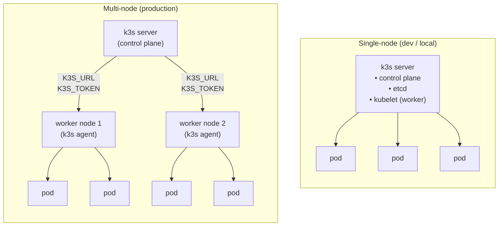

# K3s — Practical Developer Guide

> Not just commands. Real-world daily usage scenarios.

---

## Table of Contents

1. [Installation and First Run](#1-installation-and-first-run)
2. [Daily Diagnostics](#2-daily-diagnostics)
3. [Deploying Applications](#3-deploying-applications)
4. [Working with Configs](#4-working-with-configs)
5. [Troubleshooting](#5-troubleshooting) ✦ [anti-patterns](#debugging--chaotic-vs-systematic)
6. [Networking and Ingress](#6-networking-and-ingress)
7. [Storage and PVC](#7-storage-and-pvc)
8. [Secrets and ConfigMap](#8-secrets-and-configmap)
9. [Multi-Node Cluster](#9-multi-node-cluster)
10. [Useful Aliases and Scripts](#10-useful-aliases-and-scripts)

---

## 1. Installation and First Run

### Quick Start (single-node)

```bash
# Install k3s as server
curl -sfL https://get.k3s.io | sh -

# Verify everything is running
sudo k3s kubectl get nodes
```

### Without sudo — configure kubeconfig

```bash
# Copy config to ~/.kube/config
mkdir -p ~/.kube
sudo cp /etc/rancher/k3s/k3s.yaml ~/.kube/config
sudo chown $(id -u):$(id -g) ~/.kube/config

# Or set the environment variable
export KUBECONFIG=/etc/rancher/k3s/k3s.yaml
```

> **Important:** this kubeconfig usually contains `server: https://127.0.0.1:6443`,
> so it works locally on the node itself.
> If you copy the file to another machine, replace `127.0.0.1` with the real IP or DNS of the k3s server.

### Stop / start / check service

```bash
sudo systemctl status k3s
sudo systemctl restart k3s
sudo systemctl stop k3s

# Stream logs in real time
sudo journalctl -u k3s -f
```

### Uninstall k3s completely

```bash
# Server
/usr/local/bin/k3s-uninstall.sh

# Agent (worker node)
/usr/local/bin/k3s-agent-uninstall.sh
```

---

## 2. Daily Diagnostics

### "What's happening in the cluster right now?"

```bash
# General overview — node status
kubectl get nodes -o wide

# All pods across all namespaces
kubectl get pods -A

# Only problematic pods (rough text filter)
kubectl get pods -A | grep -v Running | grep -v Completed

# Node resource usage (CPU/RAM) — requires metrics-server
kubectl top nodes

# Pod resource usage — also requires metrics-server
kubectl top pods -A --sort-by=memory
```

> **Note:** if `kubectl top` returns `Metrics API not available`,
> install `metrics-server` or another metrics provider.

### "What's up with my application?"

```bash
# Deployment status
kubectl get deployment myapp -n my-namespace

# Detailed info with events
kubectl describe deployment myapp -n my-namespace

# Quick look at all resources in a namespace
kubectl get all -n my-namespace
```

### View Events — the primary diagnostic tool

```bash
# All events sorted by time
kubectl get events -A --sort-by=.metadata.creationTimestamp

# Only Warning events
kubectl get events -A --field-selector type=Warning

# Events in a specific namespace
kubectl get events -n my-namespace
```

---

## 3. Deploying Applications

### Basic deploy from file

```bash
# Apply a manifest
kubectl apply -f deployment.yaml

# Apply all manifests from a directory
kubectl apply -f ./manifests/

# Preview changes before applying (dry-run)
kubectl apply -f deployment.yaml --dry-run=client

# Diff — what will change
kubectl diff -f deployment.yaml
```

### Update image (quick new version deploy)

```bash
kubectl set image deployment/myapp \
  myapp=my-registry/myapp:v2.0.0 \
  -n my-namespace

# Watch rollout progress
kubectl rollout status deployment/myapp -n my-namespace
```

### Rollback to previous version

```bash
# View history
kubectl rollout history deployment/myapp -n my-namespace

# Roll back to previous version
kubectl rollout undo deployment/myapp -n my-namespace

# Roll back to a specific revision
kubectl rollout undo deployment/myapp --to-revision=3 -n my-namespace
```

### Scaling

```bash
# Manual
kubectl scale deployment myapp --replicas=3 -n my-namespace

# Pause / resume deployment (e.g. for batch changes)
kubectl rollout pause deployment/myapp -n my-namespace
kubectl rollout resume deployment/myapp -n my-namespace
```

### Quick image test without yaml

```bash
# Run a pod for a single command
kubectl run tmp --image=curlimages/curl --rm -it --restart=Never -- \
  curl http://myapp-service:8080/health

# Run an interactive shell
kubectl run tmp --image=alpine --rm -it --restart=Never -- sh
```

---

## 4. Working with Configs

### Switching between clusters / namespaces

```bash
# Current context
kubectl config current-context

# List contexts
kubectl config get-contexts

# Switch to a context
kubectl config use-context my-cluster

# Set default namespace
kubectl config set-context --current --namespace=my-namespace
```

### kubens / kubectx — convenient switching (recommended to install)

> **kubectx** (kube-context) — utility for quickly switching between **contexts**.
> **kubens** (kube-namespace) — utility for quickly switching between **namespaces**.
>
> **Context** (`context`) — a named entry in `~/.kube/config` that bundles three things:
> - cluster address (`cluster`)
> - credentials / certificate for authentication (`user`)
> - default namespace (`namespace`)
>
> One `~/.kube/config` can store contexts for **many** clusters (dev, staging, prod).
> `kubectl config use-context` does the same thing, but slower — you have to type the full name every time.

```bash
# Install
brew install kubectx        # macOS
# or: sudo apt install kubectx  (Debian/Ubuntu)
# or: sudo snap install kubectx --classic
# Installs both utilities: kubectx + kubens

# --- kubectx: cluster switching ---

# List all contexts (current marked with *)
kubectx

# Switch to a context
kubectx staging

# Go back to previous context (like cd -)
kubectx -

# Rename a context
kubectx prod=gke_my-project_us-central1_prod-cluster

# --- kubens: namespace switching ---

# List all namespaces (current marked with *)
kubens

# Switch to a namespace
kubens my-namespace

# Go back to previous namespace
kubens -
```

> **Tip:** after `kubens my-namespace` all subsequent `kubectl` commands
> will work in that namespace without `-n my-namespace`.

#### Interactive selection with fzf (if fzf is installed)

```bash
# brew install fzf
# kubectx and kubens automatically pick up fzf —
# when called without arguments, opens fuzzy search over the list
kubectx    # select cluster via search
kubens     # select namespace via search
```

---

## 5. Troubleshooting

### Debugging — chaotic vs systematic

```bash
# ❌ Bad — guessing, time wasted on trial and error
kubectl get pods                      # ❌ forgot -n → looking in the wrong namespace
# nothing visible... start guessing

kubectl logs myapp                    # ❌ not the full pod name → "Error from server: not found"

kubectl delete pod myapp-xxx          # ❌ deleted the pod before reading the logs
# pod restarted with the same crash — root cause still unknown

kubectl get events                    # ❌ too late — events are kept ~1h, useful ones already gone
```

```bash
# ✅ Good — systematic: broad to specific

# 1. Always specify namespace (or set default: kubens my-namespace)
kubectl get pods -n my-namespace

# 2. describe BEFORE logs — the Events section shows the cause immediately
kubectl describe pod myapp-xxx -n my-namespace
# → Events: 0/3 nodes available (oom), ImagePullBackOff, CrashLoopBackOff — cause is obvious

# 3. Logs — only if describe didn't give the answer
kubectl logs myapp-xxx -n my-namespace
kubectl logs myapp-xxx -n my-namespace --previous  # ❗ if the pod already restarted

# 4. Never delete a pod while debugging — exec into it instead
kubectl exec -it myapp-xxx -n my-namespace -- sh

# 5. If the pod never appears — check namespace-wide events
kubectl get events -n my-namespace --sort-by='.lastTimestamp' | tail -20
```

> **Flow:** `get pods` → `describe` → `logs` → `logs --previous` → `exec` → `events`.
> Delete the pod only after you've understood and fixed the root cause.

### Pod won't start — step-by-step

```bash
# Step 1: Check status
kubectl get pod myapp-xxx -n my-namespace

# Step 2: Detailed description + events
kubectl describe pod myapp-xxx -n my-namespace

# Step 3: Current container logs
kubectl logs myapp-xxx -n my-namespace

# Step 4: Previous container logs (if pod restarted)
kubectl logs myapp-xxx -n my-namespace --previous

# Step 5: Shell into a running pod
kubectl exec -it myapp-xxx -n my-namespace -- sh

# Step 6 (if pod won't start): Run a debug container
kubectl debug myapp-xxx -it --image=alpine --share-processes --copy-to=debug-pod
```

### Logs by label (all replicas at once)

```bash
# Watch logs from all deployment pods simultaneously
kubectl logs -l app=myapp -n my-namespace --all-containers -f

# Last 100 lines
kubectl logs -l app=myapp -n my-namespace --tail=100
```

### CrashLoopBackOff — common causes

| Log symptom | Cause | Fix |
|---|---|---|
| `exec format error` | Image built for wrong architecture | Build a multi-arch image |
| `permission denied` | Container lacks permissions | Check securityContext |
| `connection refused` | Dependent service not ready | Add readinessProbe / initContainer |
| `OOMKilled` | Memory limit exceeded | Increase resources.limits.memory |
| Empty log | Process crashes immediately | Run manually with `--command -- sleep 3600` |

### ImagePullBackOff — check

```bash
# Verify image is accessible from the node
sudo k3s crictl pull my-registry/myapp:v1.0.0

# Check secrets for private registry
kubectl get secret regcred -n my-namespace -o yaml

# List images on the node
sudo k3s crictl images
```

### Check network connectivity between services

```bash
# Run a temporary pod with curl and test a service
kubectl run curl-test --image=curlimages/curl --rm -it --restart=Never \
  -n my-namespace -- curl -v http://other-service:8080/

# DNS lookup inside the cluster
kubectl run dns-test --image=busybox --rm -it --restart=Never -- \
  nslookup myapp-service.my-namespace.svc.cluster.local
```

---

## 6. Networking and Ingress

### K3s Traefik Ingress (built-in)

> **Note:** Traefik is often included by default in k3s,
> but may have been disabled during installation (`--disable traefik`).
> If `Ingress` resources exist but traffic isn't routing, first check that the controller is actually installed.

```yaml
# ingress.yaml — basic example
apiVersion: networking.k8s.io/v1
kind: Ingress
metadata:
  name: myapp-ingress
  namespace: my-namespace
  annotations:
    traefik.ingress.kubernetes.io/router.entrypoints: web
spec:
  rules:
    - host: myapp.local
      http:
        paths:
          - path: /
            pathType: Prefix
            backend:
              service:
                name: myapp-service
                port:
                  number: 8080
```

```bash
# View ingresses
kubectl get ingress -A

# View Traefik dashboard (port-forward)
kubectl port-forward -n kube-system \
  $(kubectl get pods -n kube-system -l app.kubernetes.io/name=traefik -o name) \
  9000:9000
# Open: http://localhost:9000/dashboard/
```

### Port-forward for local development

```bash
# Forward a service port
kubectl port-forward service/myapp-service 8080:8080 -n my-namespace

# Forward a pod port directly
kubectl port-forward pod/myapp-xxx 8080:8080 -n my-namespace

# Accessible not just from localhost
kubectl port-forward service/myapp-service 8080:8080 -n my-namespace --address=0.0.0.0
```

### NodePort — quick external access

```bash
# View NodePort
kubectl get service myapp-service -n my-namespace

# Get node IP
kubectl get nodes -o wide
# Access: http://<NODE_IP>:<NODE_PORT>
```

---

## 7. Storage and PVC

### Glossary

| Term | Full form | What it is |
|---|---|---|
| **PV** | PersistentVolume | Physical volume — a chunk of disk that exists in the cluster. Created by an admin or automatically (dynamic provisioning). Lives independently of any pod. |
| **PVC** | PersistentVolumeClaim | A request from an application: "I need X GB with these characteristics". Kubernetes finds or creates the appropriate PV. |
| **SC** | StorageClass | A template for automatically creating PVs: describes the storage type (local disk, NFS, cloud disk), provisioner, and parameters. |
| **Provisioner** | — | Component that automatically creates PVs in response to PVCs (dynamic provisioning). k3s has `local-path-provisioner` built in. |
| **Volume Mount** | — | Mount point inside the container: the path (`mountPath`) where the volume contents will be accessible. |
| **Access Mode** | — | How the volume can be accessed (see below). |
| **Reclaim Policy** | — | What happens to the PV after the PVC is deleted: `Delete` (remove data), `Retain` (keep data). |
| **Binding** | — | State when a PVC is successfully bound to a specific PV (`STATUS: Bound`). |

#### Access Modes

| Mode | Short | Meaning |
|---|---|---|
| `ReadWriteOnce` | `RWO` | Read and write, but only **one node** at a time. Works for most apps. |
| `ReadOnlyMany` | `ROX` | Read-only, but from **many nodes** simultaneously. |
| `ReadWriteMany` | `RWX` | Read and write from **many nodes** simultaneously. Requires network storage (NFS, Longhorn, etc.). |
| `ReadWriteOncePod` | `RWOP` | Like RWO, but only **one pod** (not just a node). Kubernetes 1.22+. |

> **Important for k3s:** the built-in `local-path` supports only `RWO`.
> For `RWX` you need to install Longhorn or NFS.

### Local storage (built into k3s)

```
How it works:

  [Pod] --> mounts --> [PVC "myapp-data"]
                            |
                   Kubernetes finds or creates PV
                            |
                       [PV on node disk]
                  /var/lib/rancher/k3s/storage/
```

```yaml
# pvc.yaml — Local Path Provisioner (default in k3s)
apiVersion: v1
kind: PersistentVolumeClaim
metadata:
  name: myapp-data
  namespace: my-namespace
spec:
  accessModes:
    - ReadWriteOnce          # RWO — one pod writes, fine for most apps
  storageClassName: local-path   # built-in SC in k3s; omitting it uses the same (default)
  resources:
    requests:
      storage: 1Gi           # minimum storage size requested
```

```yaml
# deployment.yaml — how to attach a PVC to a container
spec:
  template:
    spec:
      volumes:
        - name: data-volume          # volume name inside the pod (arbitrary)
          persistentVolumeClaim:
            claimName: myapp-data    # name of the PVC above
      containers:
        - name: myapp
          image: myapp:latest
          volumeMounts:
            - name: data-volume      # references volumes[].name
              mountPath: /app/data   # path inside the container
```

```bash
# View PVCs and their status
kubectl get pvc -n my-namespace
# STATUS: Bound   — PVC is bound to a PV, all good
# STATUS: Pending — PV not found / not created yet (check events)
# STATUS: Lost    — PV was deleted, data may be gone

# Detailed PVC description (shows which PV it's bound to)
kubectl describe pvc myapp-data -n my-namespace

# View PVs (cluster-wide, no -n)
kubectl get pv

# Where data physically lives (local-path)
# Default: /var/lib/rancher/k3s/storage/
sudo ls /var/lib/rancher/k3s/storage/
```

### Access data from a PVC (for debugging)

> **Limitation:** for `local-path` (`ReadWriteOnce`) this works only
> if the PVC is not already held by another pod on a different node.
> In a multi-node scenario the debug pod may stay in `Pending`.

```bash
# Run a temporary pod that mounts the same PVC
kubectl run pvc-debug \
  --image=alpine \
  --overrides='{
    "spec": {
      "volumes": [{
        "name": "data",
        "persistentVolumeClaim": {"claimName": "myapp-data"}
      }],
      "containers": [{
        "name": "pvc-debug",
        "image": "alpine",
        "command": ["sleep", "3600"],
        "volumeMounts": [{"name": "data", "mountPath": "/data"}]
      }]
    }
  }' \
  -n my-namespace

# Shell in and inspect contents
kubectl exec -it pvc-debug -n my-namespace -- ls /data

# Clean up debug pod when done
kubectl delete pod pvc-debug -n my-namespace
```

### PVC statuses explained

```bash
kubectl get pvc -A
# NAMESPACE   NAME         STATUS   VOLUME              CAPACITY   ACCESS MODES   STORAGECLASS   AGE
# prod        myapp-data   Bound    pvc-a1b2c3...       1Gi        RWO            local-path     3d
```

| STATUS | What's happening | What to do |
|---|---|---|
| `Bound` | PVC is bound to a PV, all good | Nothing |
| `Pending` | Waiting for a PV | `kubectl describe pvc` → check Events |
| `Lost` | PV was manually deleted | Restore PV or recreate PVC |

### Expand a PVC (increase size)

```bash
# Edit the size (if StorageClass has allowVolumeExpansion: true)
kubectl edit pvc myapp-data -n my-namespace
# change: resources.requests.storage: 1Gi → 5Gi

# local-path does NOT support expansion — use Longhorn or cloud storage
```

---

## 8. Secrets and ConfigMap

### ConfigMap

```bash
# Create from file
kubectl create configmap app-config \
  --from-file=config.yaml \
  -n my-namespace

# Create from literal values
kubectl create configmap app-config \
  --from-literal=DB_HOST=localhost \
  --from-literal=DB_PORT=5432 \
  -n my-namespace

# View contents
kubectl get configmap app-config -n my-namespace -o yaml
```

### Secret

```bash
# Create a secret
kubectl create secret generic app-secrets \
  --from-literal=DB_PASSWORD=mysecret \
  --from-literal=API_KEY=abc123 \
  -n my-namespace

# View (decoded) key value
kubectl get secret app-secrets -n my-namespace \
  -o jsonpath='{.data.DB_PASSWORD}' | base64 -d

# Docker Registry secret (for private image pull)
kubectl create secret docker-registry regcred \
  --docker-server=my.registry.io \
  --docker-username=user \
  --docker-password=pass \
  -n my-namespace
```

> **Warning:** `--from-literal` is convenient for learning and quick local tests,
> but real secrets passed this way end up in shell history and often in CI logs.
> For production, use separate secret files, an external secret manager, or sealed secrets.

### Update a Secret / ConfigMap without restarting pods

```bash
# If the pod uses env from secretRef — restart is required
kubectl rollout restart deployment/myapp -n my-namespace

# If mounted as a volume — update is automatic (~1 min delay)
```

---

## 9. Multi-Node Cluster

### Single-node vs Multi-node



> In single-node mode the server is both control plane and worker.
> In multi-node, each worker runs only `k3s agent` — it connects to the server
> via `K3S_URL` and authenticates with `K3S_TOKEN`.

### Add a worker node

```bash
# On the server — get the token
sudo cat /var/lib/rancher/k3s/server/node-token

# On the worker — join the cluster
curl -sfL https://get.k3s.io | K3S_URL=https://<SERVER_IP>:6443 \
  K3S_TOKEN=<NODE_TOKEN> sh -

# Verify on the server
kubectl get nodes
```

### Labels and placement constraints

```bash
# Add a label to a node
kubectl label node worker-1 role=worker

# View labels
kubectl get nodes --show-labels

# Restrict a deployment to specific nodes (in yaml)
# nodeSelector:
#   role: worker
```

### Cordon / Drain — node maintenance

```bash
# Prevent new pods from being scheduled on the node
kubectl cordon worker-1

# Evict all pods (for maintenance)
kubectl drain worker-1 --ignore-daemonsets --delete-emptydir-data

# Return node to service
kubectl uncordon worker-1
```

---

## 10. Useful Aliases and Scripts

### ~/.bashrc / ~/.zshrc — add these aliases

```bash
# kubectl shortcuts
alias k='kubectl'
alias kga='kubectl get all -A'
alias kgp='kubectl get pods -A'
alias kgn='kubectl get nodes -o wide'
alias kge='kubectl get events -A --sort-by=.metadata.creationTimestamp'

# Follow logs
klog() { kubectl logs -f -l app="$1" -n "${2:-default}" --all-containers; }

# Shell into pod
ksh() { kubectl exec -it "$1" -n "${2:-default}" -- sh; }

# Quick port-forward
kpf() { kubectl port-forward service/"$1" "$2":"$2" -n "${3:-default}"; }

# Show all problematic pods
alias kbad='kubectl get pods -A | grep -Ev "Running|Completed"'

# Show Evicted / Failed pods for manual cleanup
alias kclean='kubectl get pods -A | grep -E "Evicted|Error|OOMKilled"'
```

> **Why no auto-delete:** piping generated commands directly into `sh`
> for administrative actions is fragile and unsafe.
> Better to review the list first, then delete explicitly.

### Script: quick deploy from local Docker image

```bash
#!/bin/bash
# deploy-local.sh — build and deploy to k3s without an external registry
# Primarily for single-node dev scenarios.
# For multi-node, the image must be imported on each node separately.

IMAGE=$1
TAG=${2:-latest}
NAMESPACE=${3:-default}
DEPLOYMENT=${4:-$IMAGE}

echo "Building image $IMAGE:$TAG..."
docker build -t $IMAGE:$TAG .

echo "Importing into k3s..."
docker save $IMAGE:$TAG | sudo k3s ctr images import -

echo "Updating deployment..."
kubectl set image deployment/$DEPLOYMENT \
  $DEPLOYMENT=$IMAGE:$TAG \
  -n $NAMESPACE

kubectl rollout status deployment/$DEPLOYMENT -n $NAMESPACE
echo "Done!"
```

> **Practical note:** use a new tag for every build (`v1`, `v2`, commit SHA).
> Leaving `latest` permanently means Kubernetes may not trigger a new rollout,
> and other nodes in a multi-node cluster won't see the locally imported image.

```bash
chmod +x deploy-local.sh
./deploy-local.sh myapp v1.2.0 production
```

### Script: full namespace health check

```bash
#!/bin/bash
# ns-health.sh — namespace status overview

NS=${1:-default}
echo "=== Nodes ==="
kubectl get nodes -o wide

echo -e "\n=== Pods in $NS ==="
kubectl get pods -n $NS -o wide

echo -e "\n=== Problematic Pods ==="
kubectl get pods -n $NS | grep -Ev "Running|Completed"

echo -e "\n=== Services ==="
kubectl get svc -n $NS

echo -e "\n=== Ingress ==="
kubectl get ingress -n $NS

echo -e "\n=== PVC ==="
kubectl get pvc -n $NS

echo -e "\n=== Recent Events (Warning) ==="
kubectl get events -n $NS \
  --field-selector type=Warning \
  --sort-by=.metadata.creationTimestamp | tail -20
```

---

## kubectl Flag Cheatsheet

| Flag | What it does | Example |
|---|---|---|
| `-n <ns>` | Specific namespace | `kubectl get pods -n prod` |
| `-A` | All namespaces | `kubectl get pods -A` |
| `-o wide` | More details | `kubectl get nodes -o wide` |
| `-o yaml` | Full YAML output | `kubectl get pod mypod -o yaml` |
| `-o json` | JSON output | `kubectl get pod mypod -o json` |
| `-o jsonpath` | Extract a field | `kubectl get pod mypod -o jsonpath='{.status.podIP}'` |
| `-f` | From file | `kubectl apply -f app.yaml` |
| `--dry-run=client` | Simulate | `kubectl apply -f app.yaml --dry-run=client` |
| `-l` | Filter by label | `kubectl get pods -l app=myapp` |
| `-w` | Watch for changes | `kubectl get pods -w` |
| `--all-containers` | All containers in pod | `kubectl logs mypod --all-containers` |
| `--previous` | Previous run | `kubectl logs mypod --previous` |

---

## Starter Manifests

### Minimal Deployment + Service

```yaml
apiVersion: apps/v1
kind: Deployment
metadata:
  name: myapp
  namespace: my-namespace
spec:
  replicas: 2
  selector:
    matchLabels:
      app: myapp
  template:
    metadata:
      labels:
        app: myapp
    spec:
      containers:
        - name: myapp
          image: my-registry/myapp:latest
          ports:
            - containerPort: 8080
          resources:
            requests:
              cpu: "100m"
              memory: "128Mi"
            limits:
              cpu: "500m"
              memory: "512Mi"
          readinessProbe:
            httpGet:
              path: /health
              port: 8080
            initialDelaySeconds: 5
            periodSeconds: 10
          livenessProbe:
            httpGet:
              path: /health
              port: 8080
            initialDelaySeconds: 15
            periodSeconds: 20
---
apiVersion: v1
kind: Service
metadata:
  name: myapp-service
  namespace: my-namespace
spec:
  selector:
    app: myapp
  ports:
    - port: 8080
      targetPort: 8080
```

---

> **Tip:** Keep all manifests in Git. Use `kubectl apply -f ./` for an entire directory.
> For more complex projects — consider Helm or Kustomize.
>
> **Helm:** detailed practical guide → [helm-guide.md](./helm-guide.md)
