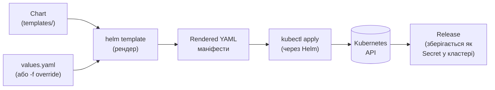

# Helm — Практичний довідник девелопера

> Не просто команди. Сценарії реального щоденного використання.

> **Дивись також:** [Docker](docker-guide.md) · [Linux](linux-guide.md) · [k3s](k3s-dev-guide.md) · [Compose → Helm](compose-to-helm.md) · [Розбір демо](examples-guide.md) · [Демо-чарт](../examples/helm/myapp)

---

## Зміст

1. [Що таке Helm і навіщо він потрібен](#1-що-таке-helm-і-навіщо-він-потрібен)
2. [Встановлення та перший запуск](#2-встановлення-та-перший-запуск)
3. [Терміни — словник](#3-терміни--словник)
4. [Робота з репозиторіями](#4-робота-з-репозиторіями)
5. [Встановлення та оновлення релізів](#5-встановлення-та-оновлення-релізів)
6. [Values — налаштування чартів](#6-values--налаштування-чартів) ✦ [антипатерни](#values--від-поганого-до-правильного)
7. [Створення власного чарту](#7-створення-власного-чарту)
8. [Шаблони — як це працює](#8-шаблони--як-це-працює) ✦ [антипатерни](#шаблони--від-поганого-до-правильного)
9. [Налагодження](#9-налагодження)
10. [Helm у CI/CD](#10-helm-у-cicd)
11. [Корисні аліаси та скрипти](#11-корисні-аліаси-та-скрипти)

---

## 1. Що таке Helm і навіщо він потрібен

```
Без Helm:                        З Helm:
  deployment.yaml                  myapp/
  service.yaml          →            Chart.yaml
  ingress.yaml                       values.yaml
  configmap.yaml                     values-prod.yaml
  secret.yaml                        templates/
  hpa.yaml                             deployment.yaml
  pvc.yaml                             service.yaml
  ...                                  ...

kubectl apply -f ./              helm install myapp ./myapp -f values-prod.yaml
```

**Helm вирішує три проблеми:**

1. **Пакування** — всі YAML-файли застосунку в один пакет (чарт).
2. **Конфігурація** — одні шаблони, різні значення для dev/staging/prod.
3. **Версіонування** — кожен деплой — це реліз з номером, можна відкотити.

### Схема: чарт → рендер → реліз



> `helm rollback` — це просто повторний `apply` попередньої версії rendered YAML,
> яка зберігається у Secret з назвою `sh.helm.release.v1.<name>.v<N>`.

---

## 2. Встановлення та перший запуск

```bash
# macOS
brew install helm

# Linux (скрипт)
# Обережно: перегляньте скрипт або перевірте checksum — не передавайте чужий код у bash наосліп
curl https://raw.githubusercontent.com/helm/helm/main/scripts/get-helm-3 | bash

# Перевірити версію
helm version
```

### Підключити автодоповнення (zsh / bash)

```bash
# zsh
echo 'source <(helm completion zsh)' >> ~/.zshrc

# bash
echo 'source <(helm completion bash)' >> ~/.bashrc
```

---

## 3. Терміни — словник

| Термін | Що це |
|---|---|
| **Chart** | Пакет Helm — тека з шаблонами YAML + `Chart.yaml` + `values.yaml`. Аналог npm-пакета. |
| **Release** | Конкретна встановлена копія чарту в кластері. Один чарт → багато релізів (myapp-dev, myapp-prod). |
| **Revision** | Номер оновлення релізу. Кожен `helm upgrade` збільшує revision на 1. Дозволяє відкотити. |
| **Repository** | Сховище чартів. Аналог npm registry або apt repo. Містить індекс і tar-архіви чартів. |
| **Values** | Набір змінних, якими параметризується чарт. Визначаються у `values.yaml` або через `--set`. |
| **Template** | YAML-файл з плейсхолдерами `{{ .Values.xxx }}`. Helm підставляє values і генерує фінальний YAML. |
| **Subchart** | Чарт-залежність, що вкладений в інший чарт (у теці `charts/`). |
| **Hooks** | Спеціальні Job-и або Pod-и, що запускаються до/після install/upgrade/delete. |
| **OCI registry** | Зберігання чартів у Docker-реєстрі (замість класичного Helm repo). Helm 3.8+. |
| **`helm upgrade --install`** | Ідемпотентна команда: встановлює якщо нема, оновлює якщо є. Стандарт для CI/CD. |
| **Release namespace** | Namespace, в якому живе реліз. Передається через `-n`. |

---

## 4. Робота з репозиторіями

```bash
# Додати репозиторій
helm repo add bitnami https://charts.bitnami.com/bitnami
helm repo add stable  https://charts.helm.sh/stable

# Оновити індекс (як apt-get update)
helm repo update

# Список доданих репозиторіїв
helm repo list

# Видалити репозиторій
helm repo remove bitnami
```

### Пошук чартів

```bash
# Шукати в доданих репозиторіях
helm search repo postgres
helm search repo redis --versions   # показати всі версії

# Шукати в Artifact Hub (публічний каталог усіх чартів)
helm search hub wordpress
```

### Переглянути що всередині чарту перед встановленням

```bash
# Переглянути values (всі налаштування з коментарями)
helm show values bitnami/postgresql

# Переглянути README чарту
helm show readme bitnami/postgresql

# Переглянути Chart.yaml (метадані, версія, залежності)
helm show chart bitnami/postgresql

# Завантажити чарт локально для вивчення
helm pull bitnami/postgresql --untar
```

### OCI-реєстри — чарти в container registry

Починаючи з Helm 3.8+ чарти можна зберігати в будь-якому OCI-сумісному
container registry (Docker Hub, GHCR, Harbor, ECR...). Це сучасний стандарт для
приватної дистрибуції чартів: не треба піднімати окремий chart-сервер —
автентифікація і сховище ті самі, що вже є для образів.

```bash
# Залогінитись (ті самі креденшали, що й docker login)
helm registry login registry.example.com

# Запакувати і запушити чарт
helm package ./mychart                # створить mychart-0.1.0.tgz
helm push mychart-0.1.0.tgz oci://registry.example.com/charts

# Встановити прямо з реєстру — helm repo add не потрібен
helm install myapp oci://registry.example.com/charts/mychart --version 0.1.0
```

---

## 5. Встановлення та оновлення релізів

### Базові команди

```bash
# Встановити чарт
# helm install <release-name> <chart> [flags]
kubectl create namespace database
helm install my-postgres bitnami/postgresql -n database

# Встановити або оновити (ідемпотентно) — стандарт для CI/CD
helm upgrade --install my-postgres bitnami/postgresql -n database --create-namespace

# Список всіх релізів
helm list -A          # всі namespace-и
helm list -n database # конкретний namespace

# Статус релізу
helm status my-postgres -n database
```

### Оновити реліз

```bash
# Оновити з новими values або новою версією чарту
helm upgrade my-postgres bitnami/postgresql \
  -n database \
  -f values.yaml \
  --version 13.2.0      # конкретна версія чарту (без --version = latest)
```

### Відкат

```bash
# Переглянути історію релізу
helm history my-postgres -n database
# REVISION  STATUS      CHART                  DESCRIPTION
# 1         superseded  postgresql-13.1.0      Install complete
# 2         deployed    postgresql-13.2.0      Upgrade complete

# Відкотити на конкретну попередню ревізію
# Спочатку подивіться номер у helm history
helm rollback my-postgres 1 -n database

# Відкотити на конкретну ревізію
helm rollback my-postgres 3 -n database
```

### Видалити реліз

```bash
# Видалити (всі ресурси кластера прибираються)
helm uninstall my-postgres -n database

# Видалити але зберегти history
helm uninstall my-postgres -n database --keep-history
```

### Корисні флаги для install / upgrade

| Флаг | Що робить |
|---|---|
| `--install` | Встановити якщо не існує (разом з `upgrade`) |
| `--atomic` | Якщо upgrade падає — автоматично відкотити |
| `--wait` | Чекати поки всі pod-и стануть Ready |
| `--timeout 5m` | Таймаут для `--wait` |
| `--dry-run` | Не застосовувати, тільки показати що буде |
| `--debug` | Детальний вивід + рендер шаблонів |
| `--create-namespace` | Створити namespace якщо не існує |
| `--version 13.2.0` | Конкретна версія чарту |

---

## 6. Values — налаштування чартів

### Три способи передати values (від меншого до більшого пріоритету)

```
1. values.yaml у чарті       (найменший пріоритет — defaults)
         ↓ перекривається
2. -f my-values.yaml         (ваш файл values)
         ↓ перекривається
3. --set key=value           (найвищий пріоритет — inline)
```

```bash
# -f: передати файл values
helm upgrade --install myapp ./myapp -f values-prod.yaml

# Декілька файлів — мерджаться зліва направо
helm upgrade --install myapp ./myapp \
  -f values-base.yaml \
  -f values-prod.yaml

# --set: одне значення
helm upgrade --install myapp ./myapp \
  --set image.tag=v2.0.0

# --set: вкладені ключі
helm upgrade --install myapp ./myapp \
  --set ingress.enabled=true \
  --set ingress.hosts[0].host=myapp.example.com

# --set-string: примусово рядок (щоб "true" не стало boolean)
helm upgrade --install myapp ./myapp --set-string someFlag=true

# --set-file: значення з файлу (наприклад, сертифікат)
helm upgrade --install myapp ./myapp --set-file tls.cert=./cert.pem
```

### Переглянути фінальні values релізу

```bash
# Values, з якими встановлено реліз (тільки ваші overrides)
helm get values my-postgres -n database

# Всі values включно з defaults
helm get values my-postgres -n database --all
```

### Типовий values.yaml для власного чарту

```yaml
# values.yaml
replicaCount: 2

image:
  repository: my-registry/myapp
  tag: "latest"          # в лапках — щоб не перетворилось на число
  pullPolicy: IfNotPresent

service:
  type: ClusterIP
  port: 8080

ingress:
  enabled: false
  host: myapp.local

resources:
  requests:
    cpu: "100m"
    memory: "128Mi"
  limits:
    cpu: "500m"
    memory: "512Mi"

env:
  DB_HOST: "postgres-service"
  DB_PORT: "5432"

secrets:
  DB_PASSWORD: ""        # передавати через --set або sealed secrets
```

### Values — від поганого до правильного

```yaml
# ❌ Погано — плоска структура, секрет у файлі, середовище захардкоджено
image: myapp:v1.0.0           # репозиторій і тег злиті — неможливо змінити окремо
replicas: 1                   # немає структури, все на одному рівні
db_password: "mysecret"       # ❌ секрет у values.yaml — потрапить у git
prod_db_host: "prod.db.local" # середовище захардкоджено — не можна перекрити без редагування
resources_cpu: "500m"         # замість вкладеного objects.resources → важко читати
```

```yaml
# ✅ Добре — вкладена структура, секрет окремо, env-overrides через -f
image:
  repository: my-registry/myapp  # репозиторій і тег окремо — кожне можна перекрити
  tag: "1.0.0"
  pullPolicy: IfNotPresent

replicaCount: 1

db:
  host: "postgres-service"
  port: 5432
  passwordSecretRef: "app-db-secret"  # посилання на k8s Secret, не сам пароль

resources:
  requests:
    cpu: "100m"
    memory: "128Mi"
  limits:
    cpu: "500m"
    memory: "512Mi"

# Секрет передається поза репо:
# helm upgrade --install myapp ./myapp --set db.password=$DB_PASS
# або через sealed-secrets / external-secrets-operator
```

> **Правило:** якщо значення різниться між dev і prod — воно має бути у values,
> не захардкоджено у шаблоні. Якщо це секрет — його не повинно бути у values.yaml взагалі.

---

## 7. Створення власного чарту

### Scaffold нового чарту

```bash
helm create myapp
# Створює структуру:
# myapp/
#   Chart.yaml            — метадані чарту
#   values.yaml           — values за замовчуванням
#   templates/            — YAML-шаблони
#     deployment.yaml
#     service.yaml
#     ingress.yaml
#     hpa.yaml
#     serviceaccount.yaml
#     _helpers.tpl        — допоміжні шаблонні функції
#     NOTES.txt           — текст що виводиться після helm install
#   charts/               — залежні субчарти
#   .helmignore           — аналог .gitignore
```

> Реальний мінімальний чарт лежить у цьому репо: [`../examples/helm/myapp`](../examples/helm/myapp) —
> deployment + service + опційний ingress, з security context-ами та пробами.
> Робочий приклад для всього, що описано нижче.

### Chart.yaml — метадані

```yaml
apiVersion: v2         # версія API Helm (v2 = Helm 3)
name: myapp
description: My application chart
type: application      # або "library" — чарт без ресурсів, тільки хелпери
version: 0.1.0         # версія самого чарту (SemVer)
appVersion: "1.0.0"    # версія застосунку (інформаційно, не впливає на Helm)

dependencies:          # залежності (субчарти)
  - name: postgresql
    version: "13.x.x"
    repository: https://charts.bitnami.com/bitnami
    condition: postgresql.enabled   # вмикати тільки якщо postgresql.enabled=true
```

```bash
# Після зміни залежностей — завантажити субчарти
helm dependency update ./myapp
# Завантажить у myapp/charts/postgresql-13.x.x.tgz
```

### Субчарти: перекриття values і фіксація версій

Values для субчарту задаються під ключем з назвою залежності — все, що лежить
під `postgresql:` у values батьківського чарту, передається вниз у чарт
postgresql:

```yaml
# values.yaml батьківського чарту
postgresql:
  enabled: true                 # відповідає condition: у Chart.yaml
  auth:
    username: myapp
    password: ""                # перекривати під час деплою, не в git
    database: myapp_db
```

```bash
# Вимкнути субчарт повністю (наприклад, prod використовує managed-базу):
helm upgrade --install myapp ./myapp --set postgresql.enabled=false
# Працює, бо в Chart.yaml оголошено condition: postgresql.enabled
```

`helm dependency update` також записує `Chart.lock` — точні резолвнуті версії
(`13.x.x` → `13.2.24`). Комітьте його: колеги та CI потім запускають
`helm dependency build`, який ставить саме зафіксовані версії, а не резолвить
діапазони заново. Та сама ідея, що й package-lock.json.

```bash
helm dependency update ./myapp   # перерезолвити діапазони версій, переписати Chart.lock
helm dependency build  ./myapp   # поставити рівно те, що в Chart.lock (для CI)
```

### values.schema.json — валідація values

Покладіть JSON Schema поруч із values.yaml — і Helm валідує змерджені values
при кожному `helm install`, `helm upgrade` і `helm lint` — автоматично, без
жодних флагів. Це ловить одруки (`replicas` замість `replicaCount`) і неправильні
типи (`port: "8080"` як рядок) ще до того, як щось потрапить у кластер, де вони
впали б значно заплутанішим чином.

```json
{
  "$schema": "https://json-schema.org/draft-07/schema#",
  "type": "object",
  "properties": {
    "image": {
      "type": "object",
      "required": ["tag"],
      "properties": {
        "tag": { "type": "string", "minLength": 1 }
      }
    },
    "service": {
      "type": "object",
      "properties": {
        "port": { "type": "integer", "minimum": 1, "maximum": 65535 }
      }
    }
  }
}
```

```bash
# Порушення схеми падає одразу зі зрозумілим повідомленням
helm lint ./myapp --set image.tag=""
# [ERROR] values don't meet the specifications of the schema(s):
# image.tag: String length must be greater than or equal to 1
```

> Повна робоча схема лежить у
> [`../examples/helm/myapp/values.schema.json`](../examples/helm/myapp/values.schema.json).

---

## 8. Шаблони — як це працює

### Базовий синтаксис

```yaml
# templates/deployment.yaml
apiVersion: apps/v1
kind: Deployment
metadata:
  # Release.Name — назва релізу (helm install <release-name>)
  # Release.Namespace — namespace релізу
  # Chart.Name — ім'я чарту з Chart.yaml
  name: {{ .Release.Name }}-{{ .Chart.Name }}
  namespace: {{ .Release.Namespace }}
  labels:
    # include викликає хелпер з _helpers.tpl
    {{- include "myapp.labels" . | nindent 4 }}
spec:
  replicas: {{ .Values.replicaCount }}
  template:
    spec:
      containers:
        - name: {{ .Chart.Name }}
          image: "{{ .Values.image.repository }}:{{ .Values.image.tag }}"
          imagePullPolicy: {{ .Values.image.pullPolicy }}
          ports:
            - containerPort: {{ .Values.service.port }}
          resources:
            {{- toYaml .Values.resources | nindent 12 }}
          env:
            {{- range $key, $val := .Values.env }}
            - name: {{ $key }}
              value: {{ $val | quote }}
            {{- end }}
```

### Умовні блоки

```yaml
# Ingress тільки якщо увімкнено
{{- if .Values.ingress.enabled }}
apiVersion: networking.k8s.io/v1
kind: Ingress
...
{{- end }}

# З дефолтним значенням (якщо не задано — "default-value")
{{ .Values.someKey | default "default-value" }}

# Перевірка наявності ключа
{{- if hasKey .Values "optionalSection" }}
  ...
{{- end }}
```

### _helpers.tpl — перевикористовувані шматки

```yaml
# templates/_helpers.tpl
{{/*
Повна назва для ресурсів
*/}}
{{- define "myapp.fullname" -}}
{{- printf "%s-%s" .Release.Name .Chart.Name | trunc 63 | trimSuffix "-" }}
{{- end }}

{{/*
Стандартні labels
*/}}
{{- define "myapp.labels" -}}
helm.sh/chart: {{ .Chart.Name }}-{{ .Chart.Version }}
app.kubernetes.io/name: {{ .Chart.Name }}
app.kubernetes.io/instance: {{ .Release.Name }}
app.kubernetes.io/managed-by: {{ .Release.Service }}
{{- end }}
```

```yaml
# Використання у шаблоні
name: {{ include "myapp.fullname" . }}
labels:
  {{- include "myapp.labels" . | nindent 4 }}
```

### Важливі функції шаблонів

| Функція | Що робить | Приклад |
|---|---|---|
| `\| nindent N` | Додати відступ N пробілів (з новим рядком перед) | `toYaml .Values.x \| nindent 8` |
| `\| indent N` | Додати відступ без нового рядка | |
| `\| quote` | Обернути в лапки | `{{ .Values.tag \| quote }}` |
| `\| default "x"` | Значення за замовчуванням | `{{ .Values.x \| default "foo" }}` |
| `\| upper` / `\| lower` | Регістр | |
| `\| b64enc` | Base64 encode (для secrets) | `{{ .Values.pass \| b64enc }}` |
| `toYaml` | Перетворити об'єкт у YAML | `{{- toYaml .Values.resources \| nindent 12 }}` |
| `tpl` | Рендерити значення як шаблон | `{{ tpl .Values.someTemplate . }}` |
| `trunc 63` | Обрізати рядок (для назв ресурсів) | `{{ .Release.Name \| trunc 63 }}` |
| `{{-` / `-}}` | Прибрати пробіл / перенос рядка | |

### Шаблони — від поганого до правильного

```yaml
# ❌ Погано — захардкоджені імена, дубльовані labels, ресурси не з values
metadata:
  name: myapp-deployment        # ❌ зламається при другому helm install або rename
  labels:
    app: myapp                  # ❌ вручну в deployment.yaml, service.yaml, ingress.yaml...
    version: "1.0.0"            # ❌ захардкоджено — не оновлюється з values
spec:
  replicas: 2                   # ❌ не з values — не можна змінити без правки шаблону
  template:
    spec:
      containers:
        - name: myapp
          image: myapp:latest   # ❌ не з values — CI не може змінити тег
          resources:
            limits:
              memory: 128Mi     # ❌ однаково для dev і prod — не гнучко
```

```yaml
# ✅ Добре — імена через helper, labels централізовано, все параметризовано
metadata:
  name: {{ include "myapp.fullname" . }}       # з _helpers.tpl — Release.Name + Chart.Name
  labels:
    {{- include "myapp.labels" . | nindent 4 }} # визначено один раз у _helpers.tpl
spec:
  replicas: {{ .Values.replicaCount }}          # з values — можна перекрити через -f або --set
  template:
    metadata:
      labels:
        {{- include "myapp.selectorLabels" . | nindent 8 }}
    spec:
      containers:
        - name: {{ .Chart.Name }}
          image: "{{ .Values.image.repository }}:{{ .Values.image.tag }}"  # з values
          resources:
            {{- toYaml .Values.resources | nindent 12 }}  # повністю з values — різне для envs
```

> **Правило:** якщо рядок зустрічається у двох шаблонах — він має бути у `_helpers.tpl`.
> Якщо значення різниться між запусками — воно має бути у `values.yaml`.

### Hooks — Job-и навколо життєвого циклу релізу

Hook — це звичайний маніфест з анотацією `helm.sh/hook`. Helm рендерить його
разом з рештою чарту, але застосовує у конкретній точці життєвого циклу — тут
міграції БД виконуються *до* викатки нової версії застосунку. Upgrade чекає,
поки Job завершиться успішно; якщо міграції впали — реліз падає, а стара версія
продовжує працювати.

```yaml
# templates/migrate-job.yaml
apiVersion: batch/v1
kind: Job
metadata:
  name: {{ include "myapp.fullname" . }}-migrate
  annotations:
    "helm.sh/hook": pre-upgrade                 # виконати до того, як upgrade застосує маніфести
    "helm.sh/hook-weight": "0"                  # порядок серед hook-ів (менша вага — раніше)
    # видалити попередній hook-Job перед створенням нового; прибрати після успіху
    "helm.sh/hook-delete-policy": before-hook-creation,hook-succeeded
spec:
  backoffLimit: 0            # не ретраїти впалу міграцію наосліп
  template:
    spec:
      restartPolicy: Never
      containers:
        - name: migrate
          image: "{{ .Values.image.repository }}:{{ .Values.image.tag }}"
          command: ["./manage.py", "migrate"]
```

Інші точки hook-ів: `pre-install`, `post-install`, `post-upgrade`, `pre-delete` тощо.

`helm test` використовує той самий механізм: Pod з анотацією `"helm.sh/hook": test`
живе у чарті і запускається тільки коли ви викликаєте `helm test <release>` —
вбудований smoke-тест одразу після деплою.

---

## 9. Налагодження

### Переглянути що Helm згенерує (без застосування)

```bash
# Рендер шаблонів локально
helm template myapp ./myapp -f values-prod.yaml

# Рендер + локальна перевірка синтаксису kubectl
helm template myapp ./myapp -f values-prod.yaml | kubectl apply --dry-run=client -f -

# Якщо є доступ до кластера — перевірка проти Kubernetes API
helm template myapp ./myapp -f values-prod.yaml | kubectl apply --dry-run=server -f -

# --debug показує values і рендер під час install/upgrade
helm upgrade --install myapp ./myapp --debug --dry-run
```

### Перевірити синтаксис чарту

```bash
# Lint — перевірка чарту на помилки та best practices
helm lint ./myapp
helm lint ./myapp -f values-prod.yaml

# Типові помилки, які знаходить lint:
# - відсутній Chart.yaml
# - невірний синтаксис шаблону
# - resource без namespace
```

### Переглянути що задеплоєно

```bash
# Маніфести, що зараз в кластері (як Helm їх бачить)
helm get manifest my-postgres -n database

# Всі values (включно з defaults)
helm get values my-postgres -n database --all

# Нотатки (NOTES.txt) після деплою
helm get notes my-postgres -n database

# Повна інформація (values + manifest + hooks)
helm get all my-postgres -n database
```

### Помилка: "release already exists" при першому install

```bash
# Якщо попередній install завис у стані pending
helm list -A --all   # --all показує навіть failed релізи

# Видалити зламаний реліз
helm uninstall my-postgres -n database --no-hooks

# Або одразу використовувати upgrade --install (не падає якщо вже є)
helm upgrade --install my-postgres bitnami/postgresql -n database
```

### Помилка: шаблон не рендериться

```bash
# Ізольований рендер одного шаблону
helm template myapp ./myapp \
  --show-only templates/deployment.yaml \
  -f values.yaml

# Перевірити конкретне значення
helm template myapp ./myapp -f values.yaml \
  | grep -A5 "image:"
```

### helm-diff — переглянути, що саме змінить upgrade

```bash
# Встановити плагін
helm plugin install https://github.com/databus23/helm-diff

# Точний diff між живим релізом і тим, що застосує upgrade
helm diff upgrade myapp ./myapp -f values-prod.yaml
```

`helm template` показує *все*; `helm diff` показує тільки те, що *змінюється* —
а саме це і треба переглянути перед upgrade-ом. У CI це де-факто стандартний
крок "approve before apply": запостити diff у PR, застосовувати тільки після
рев'ю.

---

## 10. Helm у CI/CD

### Типовий pipeline (GitHub Actions / GitLab CI)

```yaml
# .github/workflows/deploy.yaml (спрощено)
- name: Deploy
  run: |
    helm upgrade --install myapp ./helm/myapp \
      --namespace production \
      --create-namespace \
      --atomic \
      --timeout 5m \
      --wait \
      -f helm/myapp/values-prod.yaml \
      --set image.tag=${{ github.sha }}
```

### Передача секретів у CI — безпечно

```bash
# НЕ робити: --set DB_PASSWORD=plaintext прямо в команді або в values.yaml у Git
# Краще: підставляти зі змінних CI, але пам'ятати що значення все одно може потрапити в логи runner-а

# змінні приходять із vault / CI secrets store
helm upgrade --install myapp ./myapp \
  --set secrets.DB_PASSWORD="${DB_PASSWORD}" \
  --set secrets.API_KEY="${API_KEY}"
```

> **Важливо:** `--set` не є повністю безпечним способом передачі секретів.
> Для production краще використовувати External Secrets, Sealed Secrets, Vault або SOPS.

### Секрети в Git — три робочі підходи

**Sealed Secrets** — шифруєте публічним ключем кластера і комітите зашифрований
маніфест; розшифрувати його може тільки контролер всередині кластера:

```bash
# Один раз: встановити контролер у кластер
helm install sealed-secrets sealed-secrets \
  --repo https://bitnami-labs.github.io/sealed-secrets -n kube-system

# Зашифрувати звичайний маніфест Secret → маніфест SealedSecret
kubectl create secret generic app-db-secret \
  --from-literal=password=S3cret --dry-run=client -o yaml \
  | kubeseal -o yaml > sealed-secret.yaml

git add sealed-secret.yaml            # безпечно комітити — розшифрує тільки контролер
kubectl apply -f sealed-secret.yaml   # контролер створить справжній Secret у кластері
```

**SOPS + helm-secrets** — шифруєте цілий файл values ключем age або хмарного
KMS; Helm прозоро розшифровує його під час деплою:

```bash
helm plugin install https://github.com/jkroepke/helm-secrets
sops --encrypt --age <public-key> secrets.yaml > secrets.enc.yaml   # цей файл комітимо
helm secrets upgrade --install myapp ./myapp -f values-prod.yaml -f secrets.enc.yaml
```

**External Secrets Operator (ESO)** — секрети живуть у Vault / AWS Secrets
Manager / GCP SM; маніфест `ExternalSecret` (безпечний для git) синхронізує їх
у k8s Secrets:

```yaml
apiVersion: external-secrets.io/v1
kind: ExternalSecret
metadata:
  name: app-db-secret
spec:
  secretStoreRef: { name: vault-backend, kind: ClusterSecretStore }
  target: { name: app-db-secret }     # k8s Secret, який ESO створює і синхронізує
  data:
    - secretKey: password
      remoteRef: { key: myapp/db, property: password }
```

> **Що обрати:** маленька команда, git-центричний процес → Sealed Secrets або
> SOPS (без додаткової інфраструктури). У компанії вже є Vault / AWS SM / GCP SM
> → ESO, щоб секрети мали єдине джерело правди поза кластером.

### Різні values для різних середовищ

```
helm/myapp/
  values.yaml          # defaults (dev)
  values-staging.yaml  # overrides для staging
  values-prod.yaml     # overrides для prod
```

```bash
# dev
helm upgrade --install myapp ./helm/myapp

# staging
helm upgrade --install myapp ./helm/myapp -f helm/myapp/values-staging.yaml

# prod
helm upgrade --install myapp ./helm/myapp \
  -f helm/myapp/values-prod.yaml \
  --set image.tag=v1.2.3
```

### Helmfile — керування кількома релізами (рекомендовано для великих проектів)

```yaml
# helmfile.yaml
repositories:
  - name: bitnami
    url: https://charts.bitnami.com/bitnami

releases:
  - name: postgres
    namespace: database
    chart: bitnami/postgresql
    version: "13.2.0"
    values:
      - values/postgres.yaml

  - name: myapp
    namespace: production
    chart: ./helm/myapp
    values:
      - values/myapp-prod.yaml
    needs:
      - database/postgres     # деплоїти після postgres
```

```bash
# Встановити helmfile
brew install helmfile

# Застосувати всі релізи
helmfile sync

# Dry-run
helmfile diff
```

---

## 11. Корисні аліаси та скрипти

### ~/.bashrc / ~/.zshrc

```bash
# Скорочення Helm
alias h='helm'
alias hls='helm list -A'
alias hst='helm status'
alias hup='helm upgrade --install'

# Переглянути всі релізи з версіями чартів
alias hla='helm list -A -o table'

# Функція: швидкий деплой локального чарту
hdeploy() {
  local name=$1
  local chart=${2:-./helm/$1}
  local ns=${3:-default}
  local values_file="$chart/values.yaml"
  helm upgrade --install "$name" "$chart" \
    -n "$ns" --create-namespace \
    -f "$values_file" \
    --atomic --wait --timeout 5m
}
# Використання: hdeploy myapp ./helm/myapp production

# Функція: відкотити реліз
hrollback() {
  local name=$1
  local ns=${2:-default}
  echo "Revision history для $name:"
  helm history "$name" -n "$ns"
  echo -n "Введіть номер revision для відкату: "
  read rev
  [ -z "$rev" ] && return 1
  helm rollback "$name" "$rev" -n "$ns" --wait
}
```

### Скрипт: повний статус релізу

```bash
#!/bin/bash
# helm-status.sh — детальна інформація про реліз

RELEASE=$1
NS=${2:-default}

echo "=== Реліз: $RELEASE (namespace: $NS) ==="
helm status "$RELEASE" -n "$NS"

echo -e "\n=== History ==="
helm history "$RELEASE" -n "$NS"

echo -e "\n=== Values (overrides) ==="
helm get values "$RELEASE" -n "$NS"

echo -e "\n=== Pods ==="
kubectl get pods -n "$NS" -l "app.kubernetes.io/instance=$RELEASE"
```

> **Примітка:** цей фільтр працює, якщо чарт використовує стандартні Helm labels.
> Для кастомних або старих чартів мітки можуть відрізнятися.

---

## Шпаргалка по командах

| Команда | Що робить |
|---|---|
| `helm repo add <name> <url>` | Додати репозиторій |
| `helm repo update` | Оновити індекс репозиторіїв |
| `helm search repo <term>` | Шукати чарт у репозиторіях |
| `helm show values <chart>` | Переглянути values чарту |
| `helm pull <chart> --untar` | Завантажити чарт локально |
| `helm install <rel> <chart>` | Встановити реліз |
| `helm upgrade --install <rel> <chart>` | Встановити або оновити (ідемпотентно) |
| `helm list -A` | Список всіх релізів |
| `helm status <rel>` | Статус релізу |
| `helm history <rel>` | Історія ревізій |
| `helm rollback <rel> [rev]` | Відкот до ревізії |
| `helm uninstall <rel>` | Видалити реліз |
| `helm get values <rel>` | Values поточного релізу |
| `helm get manifest <rel>` | YAML маніфести релізу |
| `helm template <rel> <chart>` | Рендер без застосування |
| `helm lint <chart>` | Перевірка чарту |
| `helm create <name>` | Scaffold нового чарту |
| `helm dependency update` | Завантажити субчарти |
| `helm upgrade ... --atomic` | Авто-відкот при помилці |
| `helm upgrade ... --debug --dry-run` | Дебаг без застосування |

---

> **Порада:** Зберігайте `values-<env>.yaml` у Git разом з кодом застосунку.
> Секрети — через [Sealed Secrets](https://github.com/bitnami-labs/sealed-secrets) або Vault, не у plain-text values.
