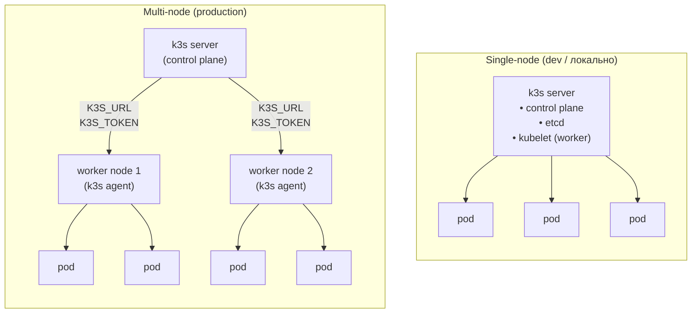

# K3s — Практичний довідник девелопера

> Не просто команди. Сценарії реального щоденного використання.

> **Дивись також:** [Docker](docker-guide.md) · [Linux](linux-guide.md) · [Helm](helm-guide.md) · [Compose → Helm](compose-to-helm.md) · [Розбір демо](examples-guide.md) · [Демо-приклад](../examples/README.md)

---

## Зміст

1. [Встановлення та перший запуск](#1-встановлення-та-перший-запуск)
2. [Оновлення та резервні копії](#2-оновлення-та-резервні-копії)
3. [Щоденна діагностика](#3-щоденна-діагностика)
4. [Деплой застосунків](#4-деплой-застосунків)
5. [Робота з конфігами](#5-робота-з-конфігами)
6. [Налагодження проблем](#6-налагодження-проблем) ✦ [антипатерни](#дебаг--від-хаотичного-до-системного)
7. [Networking та Ingress](#7-networking-та-ingress)
8. [Storage та PVC](#8-storage-та-pvc)
9. [Секрети та ConfigMap](#9-секрети-та-configmap)
10. [Основи RBAC](#10-основи-rbac)
11. [Мультинодовий кластер](#11-мультинодовий-кластер)
12. [Корисні аліаси та скрипти](#12-корисні-аліаси-та-скрипти)

---

## 1. Встановлення та перший запуск

### Швидкий старт (single-node)

```bash
# Встановити k3s як сервер
curl -sfL https://get.k3s.io | sh -

# Перевірити що все живе
sudo k3s kubectl get nodes
```

### Без sudo — налаштувати kubeconfig

```bash
# Скопіювати конфіг у ~/.kube/config
mkdir -p ~/.kube
sudo cp /etc/rancher/k3s/k3s.yaml ~/.kube/config
sudo chown $(id -u):$(id -g) ~/.kube/config

# Або встановити змінну середовища
export KUBECONFIG=/etc/rancher/k3s/k3s.yaml
```

> **Важливо:** цей kubeconfig зазвичай містить `server: https://127.0.0.1:6443`,
> тому він працює локально на самій ноді.
> Якщо копіюєте файл на іншу машину, замініть `127.0.0.1` на реальний IP або DNS сервера k3s.

### Зупинити / запустити / перевірити сервіс

```bash
sudo systemctl status k3s
sudo systemctl restart k3s
sudo systemctl stop k3s

# Переглянути логи в реальному часі
sudo journalctl -u k3s -f
```

### Видалити k3s повністю

```bash
# Сервер
/usr/local/bin/k3s-uninstall.sh

# Агент (воркер-нода)
/usr/local/bin/k3s-agent-uninstall.sh
```

---

## 2. Оновлення та резервні копії

### Оновлення k3s

Оновлення — це той самий інсталяційний скрипт, запущений повторно із зафіксованим каналом або версією:

```bash
# Спочатку перевірити, що зараз запущено
k3s --version
kubectl get nodes        # колонка VERSION — всі ноди одним поглядом

# Оновитись до останнього релізу каналу stable
curl -sfL https://get.k3s.io | INSTALL_K3S_CHANNEL=stable sh -

# Або зафіксувати точну версію (рекомендовано — відтворювано)
curl -sfL https://get.k3s.io | INSTALL_K3S_VERSION=v1.33.1+k3s1 sh -

# Перевірити після рестарту
kubectl get nodes
```

> **Порядок важливий:** спочатку завжди оновлюйте **сервер**, потім агенти.
> У multi-node кластері йдіть по одній ноді: `cordon` → drain → оновлення → `uncordon` —
> точні команди у розділі [Cordon / Drain](#cordon--drain--обслуговування-ноди).

### Бекап: single-node (SQLite)

Типовий single-node k3s зберігає стан кластера у SQLite.
Бекап робиться так: зупинити k3s і заархівувати теку з базою даних:

```bash
# 1. Зупинити k3s (запущені pod-и продовжують працювати, але API стає недоступним)
sudo systemctl stop k3s

# 2. Заархівувати базу зі станом
sudo tar czf k3s-db-backup-$(date +%F).tar.gz \
  -C /var/lib/rancher/k3s/server db/

# 3. Зберегти також токен сервера — без нього відновлення марне
sudo cp /var/lib/rancher/k3s/server/token k3s-token-backup

# 4. Запустити k3s знову
sudo systemctl start k3s
```

### Відновлення

```bash
# 1. Зупинити k3s
sudo systemctl stop k3s

# 2. Повернути базу на місце
sudo rm -rf /var/lib/rancher/k3s/server/db
sudo tar xzf k3s-db-backup-2026-07-28.tar.gz -C /var/lib/rancher/k3s/server/

# 3. Відновити токен і запустити
sudo cp k3s-token-backup /var/lib/rancher/k3s/server/token
sudo systemctl start k3s
```

> **HA-режим (embedded etcd):** якщо кластер працює на etcd замість SQLite,
> користуйтесь вбудованими снапшотами: `k3s etcd-snapshot save`,
> а відновлення — `k3s server --cluster-reset --cluster-reset-restore-path=<snapshot>`.
>
> **Практичне попередження:** бекап, який жодного разу не відновлювали, — це надія, а не бекап.
> Протестуйте процедуру відновлення на тестовій VM до того, як вона знадобиться по-справжньому.

---

## 3. Щоденна діагностика

### "Що зараз відбувається в кластері?"

```bash
# Загальний огляд — стан нод
kubectl get nodes -o wide

# Всі поди у всіх просторах імен
kubectl get pods -A

# Тільки проблемні pod-и (грубий фільтр по текстовому виводу)
kubectl get pods -A | grep -v Running | grep -v Completed

# Ресурси нод (CPU/RAM) — через metrics-server (вбудований у k3s)
kubectl top nodes

# Ресурси pod-ів
kubectl top pods -A --sort-by=memory
```

> **Примітка:** k3s постачається з `metrics-server` за замовчуванням, тому `kubectl top` працює одразу.
> Якщо повертає `Metrics API not available`, спочатку перевірте, чи компонент справді запущений:
> `kubectl -n kube-system get pods | grep metrics-server`.

### "Що з моїм застосунком?"

```bash
# Стан deployment
kubectl get deployment myapp -n my-namespace

# Детальна інформація з подіями
kubectl describe deployment myapp -n my-namespace

# Швидкий погляд на всі ресурси простору імен
kubectl get all -n my-namespace
```

### Переглянути події (Events) — головний інструмент діагностики

```bash
# Всі події, відсортовані за часом
kubectl get events -A --sort-by=.metadata.creationTimestamp

# Тільки Warning-події
kubectl get events -A --field-selector type=Warning

# Події в конкретному namespace
kubectl get events -n my-namespace
```

---

## 4. Деплой застосунків

### Базовий деплой з файлу

```bash
# Застосувати маніфест
kubectl apply -f deployment.yaml

# Застосувати всі маніфести з теки
kubectl apply -f ./manifests/

# Перевірити зміни перед застосуванням (dry-run)
kubectl apply -f deployment.yaml --dry-run=client

# Diff — що зміниться
kubectl diff -f deployment.yaml
```

### Оновити образ (швидкий деплой нової версії)

```bash
kubectl set image deployment/myapp \
  myapp=my-registry/myapp:v2.0.0 \
  -n my-namespace

# Слідкувати за прогресом rollout
kubectl rollout status deployment/myapp -n my-namespace
```

### Відкат до попередньої версії

```bash
# Переглянути історію
kubectl rollout history deployment/myapp -n my-namespace

# Відкат на попередню версію
kubectl rollout undo deployment/myapp -n my-namespace

# Відкат на конкретну ревізію
kubectl rollout undo deployment/myapp --to-revision=3 -n my-namespace
```

### Масштабування

```bash
# Вручну
kubectl scale deployment myapp --replicas=3 -n my-namespace

# Пауза / відновлення деплою (наприклад, для batch-змін)
kubectl rollout pause deployment/myapp -n my-namespace
kubectl rollout resume deployment/myapp -n my-namespace
```

### Швидкий тест образу без yaml

```bash
# Запустити pod на одну команду
kubectl run tmp --image=curlimages/curl --rm -it --restart=Never -- \
  curl http://myapp-service:8080/health

# Запустити інтерактивну оболонку
kubectl run tmp --image=alpine --rm -it --restart=Never -- sh
```

---

## 5. Робота з конфігами

### Перемикання між кластерами / namespace

```bash
# Поточний контекст
kubectl config current-context

# Список контекстів
kubectl config get-contexts

# Перемкнутись на контекст
kubectl config use-context my-cluster

# Встановити namespace за замовчуванням
kubectl config set-context --current --namespace=my-namespace
```

### kubens / kubectx — зручне перемикання (рекомендовано встановити)

> **kubectx** (kube-context) — утиліта для швидкого перемикання між **контекстами**.
> **kubens** (kube-namespace) — утиліта для швидкого перемикання між **namespace-ами**.
>
> **Контекст** (`context`) — іменований запис у `~/.kube/config`, що містить три речі разом:
> - адресу кластера (`cluster`)
> - облікові дані / сертифікат для автентифікації (`user`)
> - namespace за замовчуванням (`namespace`)
>
> Один `~/.kube/config` може зберігати контексти для **багатьох** кластерів (dev, staging, prod).
> `kubectl config use-context` робить те саме, але повільніше — треба щоразу вводити повну назву.

```bash
# Встановити
brew install kubectx        # macOS
# або: sudo apt install kubectx  (Debian/Ubuntu)
# або: sudo snap install kubectx --classic
# Встановлює обидві утиліти: kubectx + kubens

# --- kubectx: перемикання кластерів ---

# Список всіх контекстів (поточний позначено *)
kubectx

# Перемкнутись на контекст
kubectx staging

# Повернутись на попередній контекст (як cd -)
kubectx -

# Перейменувати контекст
kubectx prod=gke_my-project_us-central1_prod-cluster

# --- kubens: перемикання namespace-ів ---

# Список всіх namespace-ів (поточний позначено *)
kubens

# Перемкнутись на namespace
kubens my-namespace

# Повернутись на попередній namespace
kubens -
```

> **Підказка:** після `kubens my-namespace` всі наступні `kubectl` команди
> працюватимуть у цьому namespace без `-n my-namespace`.

#### Інтерактивний вибір з fzf (якщо встановлено fzf)

```bash
# brew install fzf
# kubectx і kubens автоматично підхоплюють fzf —
# при виклику без аргументів відкривається fuzzy-пошук по списку
kubectx    # вибір кластера через пошук
kubens     # вибір namespace через пошук
```

---

## 6. Налагодження проблем

### Дебаг — від хаотичного до системного

```bash
# ❌ Погано — хаотичний дебаг, час витрачається на здогадки
kubectl get pods                      # ❌ забули -n → дивимось не в той namespace
# нічого не видно... починаємо гадати

kubectl logs myapp                    # ❌ не повне ім'я pod → "Error from server: not found"

kubectl delete pod myapp-xxx          # ❌ видалили pod поки не прочитали логи
# pod піднявся знову з тим самим крашем, причина досі невідома

kubectl get events                    # ❌ запізно — events зберігаються ~1 год, корисні вже зникли
```

```bash
# ✅ Добре — системний підхід: від загального до конкретного

# 1. Завжди вказуй namespace (або встанови дефолтний: kubens my-namespace)
kubectl get pods -n my-namespace

# 2. describe ПЕРЕД logs — Events секція покаже причину одразу
kubectl describe pod myapp-xxx -n my-namespace
# → Events: 0/3 nodes available (oom), ImagePullBackOff, CrashLoopBackOff — причина очевидна

# 3. Логи — тільки після того як describe не дав відповіді
kubectl logs myapp-xxx -n my-namespace
kubectl logs myapp-xxx -n my-namespace --previous  # ❗ якщо pod вже рестартував

# 4. Ніколи не видаляй pod під час дебагу — зайди всередину
kubectl exec -it myapp-xxx -n my-namespace -- sh

# 5. Якщо pod взагалі не з'являється — events по namespace
kubectl get events -n my-namespace --sort-by='.lastTimestamp' | tail -20
```

> **Алгоритм:** `get pods` → `describe` → `logs` → `logs --previous` → `exec` → `events`.
> Видаляти pod — тільки якщо переконався що проблему зрозумів і виправив.

### Pod не запускається — алгоритм дій

```bash
# Крок 1: Подивитись стан
kubectl get pod myapp-xxx -n my-namespace

# Крок 2: Детальний опис + події
kubectl describe pod myapp-xxx -n my-namespace

# Крок 3: Логи поточного контейнера
kubectl logs myapp-xxx -n my-namespace

# Крок 4: Логи попереднього (якщо pod перезапускався)
kubectl logs myapp-xxx -n my-namespace --previous

# Крок 5: Зайти всередину запущеного pod
kubectl exec -it myapp-xxx -n my-namespace -- sh

# Крок 6 (якщо pod не стартує): Запустити debug-контейнер
kubectl debug myapp-xxx -it --image=alpine --share-processes --copy-to=debug-pod
```

### Логи з міткою (всі репліки одразу)

```bash
# Дивитись логи всіх pod-ів deployment одночасно
kubectl logs -l app=myapp -n my-namespace --all-containers -f

# Останні 100 рядків
kubectl logs -l app=myapp -n my-namespace --tail=100
```

### CrashLoopBackOff — типові причини

| Симптом в логах | Причина | Рішення |
|---|---|---|
| `exec format error` | Образ під іншу архітектуру | Зібрати multi-arch образ |
| `permission denied` | Контейнер не має прав | Перевірити securityContext |
| `connection refused` | Залежний сервіс не готовий | Додати readinessProbe / initContainer |
| `OOMKilled` | Перевищено ліміт пам'яті | Збільшити resources.limits.memory |
| Порожній лог | Процес падає одразу | Запустити вручну через `--command -- sleep 3600` |

### ImagePullBackOff — перевірка

```bash
# Перевірити що образ доступний з ноди
sudo k3s crictl pull my-registry/myapp:v1.0.0

# Перевірити secrets для private registry
kubectl get secret regcred -n my-namespace -o yaml

# Список образів на ноді
sudo k3s crictl images
```

### Перевірити мережеву доступність між сервісами

```bash
# Запустити тимчасовий pod з curl та перевірити сервіс
kubectl run curl-test --image=curlimages/curl --rm -it --restart=Never \
  -n my-namespace -- curl -v http://other-service:8080/

# DNS lookup всередині кластера
kubectl run dns-test --image=busybox --rm -it --restart=Never -- \
  nslookup myapp-service.my-namespace.svc.cluster.local
```

---

## 7. Networking та Ingress

### K3s Traefik Ingress (вбудований)

> **Примітка:** Traefik часто є вбудованим за замовчуванням у k3s,
> але його могли вимкнути під час інсталяції (`--disable traefik`).
> Якщо `Ingress` ресурси є, а трафік не маршрутизується, спочатку перевірте чи контролер взагалі встановлений.

```yaml
# ingress.yaml — базовий приклад
apiVersion: networking.k8s.io/v1
kind: Ingress
metadata:
  name: myapp-ingress
  namespace: my-namespace
  annotations:
    traefik.ingress.kubernetes.io/router.entrypoints: web
spec:
  rules:
    - host: myapp.local
      http:
        paths:
          - path: /
            pathType: Prefix
            backend:
              service:
                name: myapp-service
                port:
                  number: 8080
```

```bash
# Переглянути ingress
kubectl get ingress -A

# Переглянути Traefik dashboard (port-forward)
kubectl port-forward -n kube-system \
  $(kubectl get pods -n kube-system -l app.kubernetes.io/name=traefik -o name) \
  9000:9000
# Відкрити: http://localhost:9000/dashboard/
```

### TLS / HTTPS

**Ручний шлях** — сертифікат уже є (куплений або від внутрішнього CA):

```bash
# Зберегти сертифікат як TLS-секрет
kubectl create secret tls myapp-tls \
  --cert=fullchain.pem \
  --key=privkey.pem \
  -n my-namespace
```

```yaml
# Додати spec.tls до прикладу ingress вище
spec:
  tls:
    - hosts:
        - myapp.local
      secretName: myapp-tls
  rules:
    # ... без змін
```

**Автоматизований шлях** — cert-manager сам випускає і поновлює сертифікати Let's Encrypt:

```bash
# Встановити cert-manager через Helm
helm repo add jetstack https://charts.jetstack.io
helm repo update
helm install cert-manager jetstack/cert-manager \
  --namespace cert-manager --create-namespace \
  --set crds.enabled=true
```

```yaml
# clusterissuer.yaml — Let's Encrypt з HTTP-01 через вбудований Traefik
apiVersion: cert-manager.io/v1
kind: ClusterIssuer
metadata:
  name: letsencrypt-prod
spec:
  acme:
    server: https://acme-v02.api.letsencrypt.org/directory
    email: you@example.com
    privateKeySecretRef:
      name: letsencrypt-prod
    solvers:
      - http01:
          ingress:
            class: traefik
```

```yaml
# На Ingress: одна анотація + spec.tls — решту робить cert-manager
metadata:
  annotations:
    cert-manager.io/cluster-issuer: letsencrypt-prod
spec:
  tls:
    - hosts:
        - myapp.example.com
      secretName: myapp-tls   # cert-manager сам створює і поновлює цей секрет
```

> **У цьому репозиторії:** демо-чарт [`../examples/helm/myapp`](../examples/helm/myapp)
> містить опційний ingress, готовий до TLS — вмикається через `ingress.enabled`
> та `ingress.tls.enabled` у `values.yaml`.

### Port-forward для локальної розробки

```bash
# Пробросити порт сервісу
kubectl port-forward service/myapp-service 8080:8080 -n my-namespace

# Пробросити порт pod-а напряму
kubectl port-forward pod/myapp-xxx 8080:8080 -n my-namespace

# Доступно не тільки з localhost
kubectl port-forward service/myapp-service 8080:8080 -n my-namespace --address=0.0.0.0
```

### NodePort — швидкий доступ ззовні

```bash
# Переглянути NodePort
kubectl get service myapp-service -n my-namespace

# Дізнатись IP ноди
kubectl get nodes -o wide
# Доступ: http://<NODE_IP>:<NODE_PORT>
```

---

## 8. Storage та PVC

### Терміни

| Термін | Розшифровка | Що це |
|---|---|---|
| **PV** | PersistentVolume | Фізичний том — шматок диска, що існує в кластері. Створюється адміністратором або автоматично (dynamic provisioning). Живе незалежно від pod-а. |
| **PVC** | PersistentVolumeClaim | Заявка від застосунку: "мені потрібно Х GB з такими характеристиками". Kubernetes сам знаходить або створює відповідний PV. |
| **SC** | StorageClass | Шаблон для автоматичного створення PV: описує тип сховища (локальний диск, NFS, cloud-диск), provisioner і параметри. |
| **Provisioner** | — | Компонент, що автоматично створює PV у відповідь на PVC (dynamic provisioning). У k3s вбудований `local-path-provisioner`. |
| **Volume Mount** | — | Точка монтування тому всередині контейнера: шлях (`mountPath`), куди буде доступний вміст тому. |
| **Access Mode** | — | Режим доступу до тому (детальніше нижче). |
| **Reclaim Policy** | — | Що відбувається з PV після видалення PVC: `Delete` (видалити дані), `Retain` (залишити дані). |
| **Binding** | — | Стан, коли PVC успішно "прив'язаний" до конкретного PV (`STATUS: Bound`). |

#### Access Modes — режими доступу

| Режим | Скорочення | Значення |
|---|---|---|
| `ReadWriteOnce` | `RWO` | Читання і запис, але тільки **одна нода** одночасно. Підходить для більшості застосунків. |
| `ReadOnlyMany` | `ROX` | Тільки читання, але **багато нод** одночасно. |
| `ReadWriteMany` | `RWX` | Читання і запис з **багатьох нод** одночасно. Потребує мережевого сховища (NFS, Longhorn тощо). |
| `ReadWriteOncePod` | `RWOP` | Як RWO, але тільки **один pod** (не просто нода). Kubernetes 1.22+. |

> **Важливо для k3s:** вбудований `local-path` підтримує тільки `RWO`.
> Для `RWX` треба встановити Longhorn або NFS.

### Локальний storage (вбудований в k3s)

```
Схема роботи:

  [Pod] --> монтує --> [PVC "myapp-data"]
                            |
                     Kubernetes знаходить
                     або створює PV
                            |
                       [PV на диску ноди]
                  /var/lib/rancher/k3s/storage/
```

```yaml
# pvc.yaml — Local Path Provisioner (default у k3s)
apiVersion: v1
kind: PersistentVolumeClaim
metadata:
  name: myapp-data
  namespace: my-namespace
spec:
  accessModes:
    - ReadWriteOnce          # RWO — один pod пише, нормально для більшості застосунків
  storageClassName: local-path   # вбудований SC у k3s; якщо не вказати — теж він (default)
  resources:
    requests:
      storage: 1Gi           # мінімальний розмір, що запитується
```

```yaml
# deployment.yaml — як підключити PVC до контейнера
spec:
  template:
    spec:
      volumes:
        - name: data-volume          # ім'я тому всередині pod-а (довільне)
          persistentVolumeClaim:
            claimName: myapp-data    # назва PVC вище
      containers:
        - name: myapp
          image: myapp:latest
          volumeMounts:
            - name: data-volume      # посилання на volumes[].name
              mountPath: /app/data   # шлях всередині контейнера
```

```bash
# Переглянути PVC та їх статус
kubectl get pvc -n my-namespace
# STATUS: Bound   — PVC прив'язаний до PV, все ОК
# STATUS: Pending — PV ще не знайдено / не створено (перевірити events)
# STATUS: Lost    — PV був видалений, дані можливо втрачені

# Детальний опис PVC (показує до якого PV прив'язаний)
kubectl describe pvc myapp-data -n my-namespace

# Переглянути PV (cluster-wide, без -n)
kubectl get pv

# Де фізично лежать дані (local-path)
# За замовчуванням: /var/lib/rancher/k3s/storage/
sudo ls /var/lib/rancher/k3s/storage/
```

### Отримати доступ до даних з PVC (для налагодження)

> **Обмеження:** для `local-path` (`ReadWriteOnce`) цей прийом працює,
> якщо PVC не зайнятий іншим pod-ом на іншій ноді.
> У multi-node сценарії другий debug-pod може залишитись у `Pending`.

```bash
# Запустити тимчасовий pod що монтує той самий PVC
kubectl run pvc-debug \
  --image=alpine \
  --overrides='{
    "spec": {
      "volumes": [{
        "name": "data",
        "persistentVolumeClaim": {"claimName": "myapp-data"}
      }],
      "containers": [{
        "name": "pvc-debug",
        "image": "alpine",
        "command": ["sleep", "3600"],
        "volumeMounts": [{"name": "data", "mountPath": "/data"}]
      }]
    }
  }' \
  -n my-namespace

# Зайти і переглянути вміст
kubectl exec -it pvc-debug -n my-namespace -- ls /data

# Прибрати debug-pod після роботи
kubectl delete pod pvc-debug -n my-namespace
```

### Статуси PVC — що означають

```bash
kubectl get pvc -A
# NAMESPACE   NAME         STATUS   VOLUME              CAPACITY   ACCESS MODES   STORAGECLASS   AGE
# prod        myapp-data   Bound    pvc-a1b2c3...       1Gi        RWO            local-path     3d
```

| STATUS | Що відбувається | Що робити |
|---|---|---|
| `Bound` | PVC прив'язаний до PV, все ОК | Нічого |
| `Pending` | Чекає на PV | `kubectl describe pvc` → дивитись Events |
| `Lost` | PV видалений вручну | Відновити PV або пересоздати PVC |

### Розширити PVC (збільшити розмір)

```bash
# Відредагувати розмір (якщо StorageClass підтримує allowVolumeExpansion: true)
kubectl edit pvc myapp-data -n my-namespace
# змінити: resources.requests.storage: 1Gi → 5Gi

# local-path НЕ підтримує розширення — треба Longhorn або cloud storage
```

---

## 9. Секрети та ConfigMap

### ConfigMap

```bash
# Створити з файлу
kubectl create configmap app-config \
  --from-file=config.yaml \
  -n my-namespace

# Створити з літералів
kubectl create configmap app-config \
  --from-literal=DB_HOST=localhost \
  --from-literal=DB_PORT=5432 \
  -n my-namespace

# Переглянути вміст
kubectl get configmap app-config -n my-namespace -o yaml
```

### Secret

```bash
# Створити секрет
kubectl create secret generic app-secrets \
  --from-literal=DB_PASSWORD=mysecret \
  --from-literal=API_KEY=abc123 \
  -n my-namespace

# Переглянути (декодований) ключ
kubectl get secret app-secrets -n my-namespace \
  -o jsonpath='{.data.DB_PASSWORD}' | base64 -d

# Secret для Docker Registry (private image pull)
kubectl create secret docker-registry regcred \
  --docker-server=my.registry.io \
  --docker-username=user \
  --docker-password=pass \
  -n my-namespace
```

> **Обережно:** `--from-literal` зручний для навчання і швидких локальних тестів,
> але реальні секрети так потрапляють у shell history і часто в CI-логи.
> Для production краще використовувати окремі secret-файли, зовнішній secret manager або sealed secrets.

### Оновити секрет / ConfigMap без перезапуску pod-а

```bash
# Якщо pod використовує env з secretRef — треба restart
kubectl rollout restart deployment/myapp -n my-namespace

# Якщо монтується як volume — оновлення автоматичне (через ~1 хв)
```

---

## 10. Основи RBAC

### Сценарій: CI-пайплайн деплоїть в один namespace і більше нікуди

CI-джоба не повинна користуватись адмінським kubeconfig. Дайте їй ServiceAccount,
чиї права закінчуються на межі namespace:

```yaml
# ci-deployer.yaml — ServiceAccount + Role + RoleBinding
apiVersion: v1
kind: ServiceAccount
metadata:
  name: ci-deployer
  namespace: myns
---
apiVersion: rbac.authorization.k8s.io/v1
kind: Role
metadata:
  name: ci-deployer
  namespace: myns
rules:
  - apiGroups: ["apps"]
    resources: ["deployments"]
    verbs: ["get", "list", "watch", "create", "update", "patch"]
  - apiGroups: [""]
    resources: ["services", "configmaps", "pods"]
    verbs: ["get", "list", "watch", "create", "update", "patch"]
---
apiVersion: rbac.authorization.k8s.io/v1
kind: RoleBinding
metadata:
  name: ci-deployer
  namespace: myns
subjects:
  - kind: ServiceAccount
    name: ci-deployer
    namespace: myns
roleRef:
  kind: Role
  name: ci-deployer
  apiGroup: rbac.authorization.k8s.io
```

```bash
kubectl apply -f ci-deployer.yaml

# Видати токен для CI (рік; коротший — краще, якщо CI вміє його оновлювати)
kubectl create token ci-deployer -n myns --duration=8760h
# Альтернатива: bound token Secret (тип kubernetes.io/service-account-token)
# не протухає, але його треба відкликати вручну

# Підключити токен в окремий kubeconfig для CI:
# kubectl config set-credentials ci-deployer --token=<TOKEN>
# kubectl config set-context ci --cluster=<cluster> --user=ci-deployer --namespace=myns
```

> **Role vs ClusterRole:** `Role` працює всередині одного namespace;
> `ClusterRole` покриває cluster-wide ресурси (ноди, PV) або всі namespace одразу.
> Для CI-деплоїв namespace-обмежений `Role` — саме те, що треба (least privilege).

```bash
# Перевірити: що цей ServiceAccount реально може?
kubectl auth can-i --as=system:serviceaccount:myns:ci-deployer \
  create deployments -n myns          # yes

kubectl auth can-i --as=system:serviceaccount:myns:ci-deployer \
  delete pods -n kube-system          # no — в цьому і сенс
```

---

## 11. Мультинодовий кластер

### Single-node vs Multi-node



> У single-node режимі сервер одночасно є і control plane, і worker.
> У multi-node воркер запускає тільки `k3s agent` — він з'єднується з сервером
> через `K3S_URL` і реєструється за допомогою `K3S_TOKEN`.

### Додати воркер-ноду

```bash
# На сервері — отримати токен
sudo cat /var/lib/rancher/k3s/server/node-token

# На воркері — приєднатись до кластера
curl -sfL https://get.k3s.io | K3S_URL=https://<SERVER_IP>:6443 \
  K3S_TOKEN=<NODE_TOKEN> sh -

# Перевірити на сервері
kubectl get nodes
```

### Мітки та обмеження розміщення

```bash
# Додати мітку ноді
kubectl label node worker-1 role=worker

# Переглянути мітки
kubectl get nodes --show-labels

# Обмежити deployment тільки на конкретні ноди (у yaml)
# nodeSelector:
#   role: worker
```

### Cordon / Drain — обслуговування ноди

```bash
# Заборонити планування нових pod-ів на ноді
kubectl cordon worker-1

# Виселити всі pod-и (для обслуговування)
kubectl drain worker-1 --ignore-daemonsets --delete-emptydir-data

# Повернути ноду в роботу
kubectl uncordon worker-1
```

---

## 12. Корисні аліаси та скрипти

### ~/.bashrc / ~/.zshrc — додати ці аліаси

```bash
# Скорочення kubectl
alias k='kubectl'
alias kga='kubectl get all -A'
alias kgp='kubectl get pods -A'
alias kgn='kubectl get nodes -o wide'
alias kge='kubectl get events -A --sort-by=.metadata.creationTimestamp'

# Логи з follow
klog() { kubectl logs -f -l app="$1" -n "${2:-default}" --all-containers; }

# Зайти в pod
ksh() { kubectl exec -it "$1" -n "${2:-default}" -- sh; }

# Швидкий port-forward
kpf() { kubectl port-forward service/"$1" "$2":"$2" -n "${3:-default}"; }

# Переглянути всі проблемні pod-и
alias kbad='kubectl get pods -A | grep -Ev "Running|Completed"'

# Показати Evicted / Failed pod-и для ручного прибирання
alias kclean='kubectl get pods -A | grep -E "Evicted|Error|OOMKilled"'
```

> **Чому без авто-видалення:** пайпити згенеровані команди напряму в `sh`
> для адміністративних дій крихко і небезпечно.
> Краще спочатку переглянути список, а потім видаляти явно.

### Скрипт: швидкий деплой з локального Docker образу

```bash
#!/bin/bash
# deploy-local.sh — збірка і деплой в k3s без зовнішнього registry
# Підходить насамперед для single-node dev-сценарію.
# Для multi-node образ треба імпортувати на кожну ноду окремо.

IMAGE=$1
TAG=${2:-latest}
NAMESPACE=${3:-default}
DEPLOYMENT=${4:-$IMAGE}

echo "Збираємо образ $IMAGE:$TAG..."
docker build -t $IMAGE:$TAG .

echo "Імпортуємо в k3s..."
docker save $IMAGE:$TAG | sudo k3s ctr images import -

echo "Оновлюємо deployment..."
kubectl set image deployment/$DEPLOYMENT \
  $DEPLOYMENT=$IMAGE:$TAG \
  -n $NAMESPACE

kubectl rollout status deployment/$DEPLOYMENT -n $NAMESPACE
echo "Готово!"
```

> **Практична примітка:** використовуйте новий тег на кожну збірку (`v1`, `v2`, commit SHA).
> Якщо постійно лишати `latest`, Kubernetes може не зробити нового rollout,
> а інші ноди в multi-node кластері не побачать локально імпортований образ.

```bash
chmod +x deploy-local.sh
./deploy-local.sh myapp v1.2.0 production
```

> **У цьому репозиторії:** повніша версія цього скрипта лежить у
> [`../examples/k3s/deploy.sh`](../examples/k3s/deploy.sh) — вона додає Helm-деплой
> з `--atomic`, створення namespace та перевірку залежностей.

### Скрипт: повна діагностика namespace

```bash
#!/bin/bash
# ns-health.sh — огляд стану namespace

NS=${1:-default}
echo "=== Nodes ==="
kubectl get nodes -o wide

echo -e "\n=== Pods в $NS ==="
kubectl get pods -n $NS -o wide

echo -e "\n=== Проблемні Pod-и ==="
kubectl get pods -n $NS | grep -Ev "Running|Completed"

echo -e "\n=== Services ==="
kubectl get svc -n $NS

echo -e "\n=== Ingress ==="
kubectl get ingress -n $NS

echo -e "\n=== PVC ==="
kubectl get pvc -n $NS

echo -e "\n=== Recent Events (Warning) ==="
kubectl get events -n $NS \
  --field-selector type=Warning \
  --sort-by=.metadata.creationTimestamp | tail -20
```

---

## Шпаргалка по `kubectl` флагах

| Флаг | Що робить | Приклад |
|---|---|---|
| `-n <ns>` | Конкретний namespace | `kubectl get pods -n prod` |
| `-A` | Всі namespace | `kubectl get pods -A` |
| `-o wide` | Більше деталей | `kubectl get nodes -o wide` |
| `-o yaml` | Повний YAML | `kubectl get pod mypod -o yaml` |
| `-o json` | JSON вивід | `kubectl get pod mypod -o json` |
| `-o jsonpath` | Витягти поле | `kubectl get pod mypod -o jsonpath='{.status.podIP}'` |
| `-f` | З файлу | `kubectl apply -f app.yaml` |
| `--dry-run=client` | Симуляція | `kubectl apply -f app.yaml --dry-run=client` |
| `-l` | Фільтр за міткою | `kubectl get pods -l app=myapp` |
| `-w` | Слідкувати за змінами | `kubectl get pods -w` |
| `--all-containers` | Всі контейнери pod-а | `kubectl logs mypod --all-containers` |
| `--previous` | Попередній запуск | `kubectl logs mypod --previous` |

---

## Типові маніфести для швидкого старту

### CronJob (задача за розкладом)

> **Deployment** — для процесів, що працюють постійно (веб-сервери, воркери).
> **Job** виконується один раз до завершення; **CronJob** запускає Job за розкладом —
> використовуйте їх для міграцій, бекапів, генерації звітів.

```yaml
apiVersion: batch/v1
kind: CronJob
metadata:
  name: db-backup
  namespace: my-namespace
spec:
  schedule: "0 3 * * *"           # щодня о 03:00 (cron-синтаксис)
  concurrencyPolicy: Forbid       # не запускати новий запуск, поки триває попередній
  successfulJobsHistoryLimit: 3   # тримати останні 3 успішні pod-и для логів
  failedJobsHistoryLimit: 3
  jobTemplate:
    spec:
      backoffLimit: 2             # повторити невдалий запуск максимум 2 рази
      template:
        spec:
          restartPolicy: Never    # для Job: Never або OnFailure, не Always
          containers:
            - name: backup
              image: my-registry/backup-tool:latest
              args: ["--target", "s3://backups/daily"]
```

### Мінімальний Deployment + Service

```yaml
apiVersion: apps/v1
kind: Deployment
metadata:
  name: myapp
  namespace: my-namespace
spec:
  replicas: 2
  selector:
    matchLabels:
      app: myapp
  template:
    metadata:
      labels:
        app: myapp
    spec:
      containers:
        - name: myapp
          image: my-registry/myapp:latest
          ports:
            - containerPort: 8080
          resources:
            requests:
              cpu: "100m"
              memory: "128Mi"
            limits:
              cpu: "500m"
              memory: "512Mi"
          readinessProbe:
            httpGet:
              path: /health
              port: 8080
            initialDelaySeconds: 5
            periodSeconds: 10
          livenessProbe:
            httpGet:
              path: /health
              port: 8080
            initialDelaySeconds: 15
            periodSeconds: 20
---
apiVersion: v1
kind: Service
metadata:
  name: myapp-service
  namespace: my-namespace
spec:
  selector:
    app: myapp
  ports:
    - port: 8080
      targetPort: 8080
```

---

> **Порада:** Зберігайте всі маніфести у Git. Використовуйте `kubectl apply -f ./` для всієї теки.
> Для складніших проектів оберіть інструмент пакування:
>
> - **Helm** — шаблонізація + версіоновані релізи + rollback; найкраще для перевикористовуваних,
>   мультисередовищних пакетів → [helm-guide.md](./helm-guide.md)
> - **Kustomize** — патчі/overlay поверх звичайного YAML, вбудований у kubectl (`kubectl apply -k`);
>   найкраще, коли шаблонізація взагалі не потрібна
> - Переходите з Docker Compose? → [compose-to-helm.md](./compose-to-helm.md)
